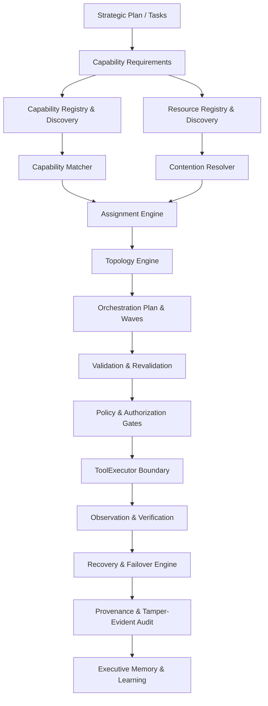

# Kairo Resource & Capability Orchestration Engine (Task 59)

## 1. Overview & Core Objective
The **Kairo Resource & Capability Orchestration Engine** provides high-assurance mapping, allocation, scheduling, and multi-agent coordination for complex tasks across distributed tools, agents, and cloud resources.

The engine transforms:
```
STRATEGIC PLAN + TASK GRAPH + GOALS + CURRENT ENVIRONMENT + AVAILABLE CAPABILITIES + AVAILABLE RESOURCES + POLICY + AUTHORIZATION + RISK + DEPENDENCIES
↓
CAPABILITY MAP → RESOURCE PLAN → ASSIGNMENT PLAN → ORCHESTRATION GRAPH → EXECUTION WAVES → MONITORING → REALLOCATION → RECOVERY → OUTCOME → LEARNING
```

---

## 2. Core Invariants & Security Architecture
1. **Concept Independence**: Capability $\ne$ Resource $\ne$ Tool $\ne$ Agent $\ne$ Service $\ne$ Role $\ne$ Permission $\ne$ Credential $\ne$ Task $\ne$ Assignment $\ne$ Execution.
2. **Capability $\ne$ Authorization**: A capability without explicit authorization remains strictly `NOT_EXECUTABLE`.
3. **Execution Boundary Firewall**: The Orchestrator coordinates; it **never directly executes production side-effecting tools** (`OrchestrationExecutionBoundaryError`). Execution must strictly flow through:
   $$\text{Orchestrator} \to \text{Policy} \to \text{Authorization} \to \text{Approval} \to \text{ToolExecutor} \to \text{Verification}$$
4. **Separation of Duties**: Creator $\ne$ reviewer $\ne$ approver $\ne$ executor $\ne$ verifier for high-impact actions (no self-approval).
5. **No Fabricated Data**: Unknown resources are never assumed available (`Unknown != Available`); missing capabilities return `CAPABILITY_UNAVAILABLE`.
6. **Idempotency-Aware Recovery**: Non-idempotent operations (destructive writes, financial, migrations) are never blindly retried; they require reconciliation via Digital Twin / verification.
7. **Resource Isolation & Fairness**: Multi-tenant reservations prevent cross-project resource theft. Anti-starvation queue aging ensures lower-priority tasks execute fairly.

---

## 3. Subsystem Architecture Diagram


---

## 4. REST API Endpoints
All endpoints are mounted under `/api/v1/orchestration`:
- `POST /analyze`: Feasibility gap analysis, capability matching, and contention detection.
- `POST /`: Create an executable `OrchestrationPlan`.
- `GET /catalog/capabilities`: List registered and discovered system capabilities.
- `GET /catalog/resources`: List managed resources, capacities, and quotas.
- `POST /resources/reserve`: Create a time-bounded resource reservation.
- `POST /resources/release`: Release a resource reservation and restore capacity.
- `GET /list`: List active and historical orchestration plans.
- `GET /{id}`: Retrieve orchestration plan by ID.
- `GET /{id}/assignments`: Retrieve task assignments.
- `GET /{id}/topology`: Retrieve execution graph, waves, barriers, and handoffs.
- `POST /{id}/revalidate`: Pre-execution validation against environmental drift.
- `POST /{id}/failover`: Trigger dynamic failover to fallback providers.
- `GET /{id}/health`: Health check and resource leak report.
- `GET /explain/{task_id}`: Explain why a provider was assigned.
- `GET /audit/trail`: Retrieve immutable SHA-256 audit log.
