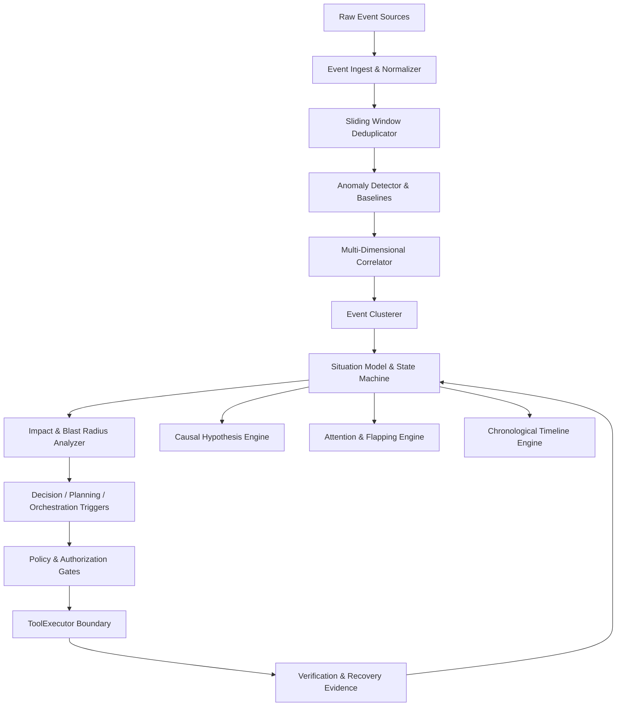

# Kairo Real-Time Situational Awareness & Event Correlation Engine (Task 60)

## 1. Overview & Core Objective
The **Kairo Real-Time Situational Awareness & Event Correlation Engine** continuously synthesizes heterogeneous observations, telemetry, and system signals into unified, correlated operational situations with full impact blast radius, ranked causal hypotheses, and attention prioritization.

The engine transforms:
```
EVENTS → NORMALIZED EVENTS → CORRELATED EVENTS → INCIDENTS / SITUATIONS → CURRENT STATE → IMPACT → CONTEXT → CAUSAL HYPOTHESES → RISK → PREDICTIONS → DECISION TRIGGERS → PLAN IMPACT → ORCHESTRATION RESPONSE → VERIFICATION → UPDATED SITUATION
```

---

## 2. Core Invariants & Security Architecture
1. **Concept Independence**: Observation $\ne$ Event $\ne$ Signal $\ne$ Anomaly $\ne$ Incident $\ne$ Situation $\ne$ Cause $\ne$ Hypothesis $\ne$ Impact $\ne$ Risk $\ne$ Decision $\ne$ Action $\ne$ Outcome.
2. **Correlation $\ne$ Causation**: Correlated events provide evidence for hypotheses, never automatic proof of causality.
3. **Hypothesis $\ne$ Fact**: Causal hypotheses remain explicitly marked with uncertainty; `ROOT_CAUSE_UNKNOWN` is valid and preserved.
4. **Execution Boundary Firewall**: Situational awareness observes, assesses, and triggers; it **never directly executes production side-effecting tools** (`SituationalAwarenessExecutionBoundaryError`). All remediation workflows route via:
   $$\text{Situational Awareness} \to \text{Policy} \to \text{Authorization} \to \text{Approval} \to \text{ToolExecutor} \to \text{Verification}$$
5. **Attention $\ne$ Action**: High attention score does not trigger un-gated automatic execution.
6. **Decision Trigger $\ne$ Decision**: Situations formulate decision requests for `app.decision`, never unilateral decisions.
7. **Silence $\ne$ Recovery**: Disappearance of alerts alone does not close an incident; resolution requires verified evidence.
8. **Baseline Poisoning Defense**: Data from active incident periods is quarantined from contaminating normal operational baselines.
9. **Prompt Injection Defense**: External event payloads are treated strictly as untrusted raw strings.
10. **Replay Safety**: Event replay is isolated and prohibited from mutating production state.

---

## 3. Subsystem Architecture Diagram


---

## 4. REST API Endpoints
All endpoints are mounted under `/api/v1/situations`:
- `POST /events`: Ingest, normalize, deduplicate, and correlate incoming events.
- `GET /`: List active and historical situations.
- `GET /{id}`: Retrieve situation by ID.
- `GET /{id}/timeline`: Retrieve chronological event timeline.
- `GET /{id}/impact`: Retrieve blast radius and plan/goal threat propagation.
- `GET /{id}/hypotheses`: Retrieve ranked causal hypotheses.
- `POST /{id}/resolve`: Resolve situation with verified evidence.
- `POST /{id}/escalate`: Escalate situation severity.
- `GET /attention/feed`: Prioritized attention items feed.
- `GET /baselines/catalog`: Operational signal baselines.
- `GET /audit/trail`: Cryptographic SHA-256 audit log.
