# KAIRO Autonomous Claim Verification, Source Integrity & Evidence Provenance Engine (Task 116)

## 1. Executive Summary & Core Architectural Invariant

The **Claim Verification, Source Integrity & Evidence Provenance Engine** provides a production-grade, persistent, auditable, and mathematically grounded lineage verification subsystem for Kairo.

Its responsibility is:
$$\text{SOURCE} \to \text{EVIDENCE} \to \text{PROVENANCE} \to \text{VERIFICATION} \to \text{STRUCTURED EVIDENCE FOR INTELLIGENCE}$$

### Fundamental Invariant
$$\text{SOURCE} \neq \text{DOCUMENT} \neq \text{OBSERVATION} \neq \text{EXTRACTED EVIDENCE} \neq \text{CLAIM} \neq \text{INTERPRETATION} \neq \text{INFERENCE} \neq \text{VERIFICATION} \neq \text{BELIEF} \neq \text{TRUTH} \neq \text{AUTHORIZATION}$$

- **No Second Truth Engine:** Verification does not declare absolute truth or override existing belief authority.
- **Uncertainty Preserved:** Statuses include `VERIFIED_UNDER_SCOPE`, `PARTIALLY_VERIFIED`, `SUPPORTED`, `CONTRADICTED`, `INCONCLUSIVE`, `UNVERIFIABLE`, `STALE`, `EXPIRED`, `SOURCE_UNTRUSTED`, `EVIDENCE_INSUFFICIENT`, and `UNKNOWN`. Certainty is never fabricated.
- **True Independence vs. Copy Chains:** If Source B copied Source A, or citations form a cycle ($A \to B \to C \to A$), they are formally categorized as `DEPENDENT_SUPPORT` or circular dependencies—never independent corroboration.

---

## 2. System Architecture

```mermaid
graph TD
    UserReq[Verification Request] --> Pipe[25-Step Pipeline]
    Pipe --> FragEng[Claim Fragmentation Engine]
    FragEng --> Atomic[Atomic Claims]
    FragEng --> Causal[Causal Fragments]
    FragEng --> Temporal[Temporal Fragments]

    Pipe --> IntegEng[Content Integrity Engine]
    IntegEng --> Hashing[SHA-256 Hashes]
    IntegEng --> Drift[Snapshot Drift Detection]
    IntegEng --> Sanitizer[Prompt Injection Disarmer]

    Pipe --> ProvEng[Provenance Engine]
    ProvEng --> CopyDet[Copy & Derivation Detector]
    ProvEng --> CycleDet[Circularity / Cycle Detector]
    ProvEng --> DAG[W3C-PROV Lineage DAG]

    Pipe --> CorrobEng[Corroboration & Contradiction Engine]
    CorrobEng --> Corrob[Independence-Aware Corroboration]
    CorrobEng --> Contra[8-Dimensional Contradiction Detector]
    CorrobEng --> NegEvi[Negative Evidence Rigor]

    Pipe --> ReproEng[Reproducibility Engine]
    ReproEng --> EnvFingerprint[Environment Fingerprint]
    ReproEng --> ReproAudit[Deterministic Hash Audit]

    Pipe --> Bridges[Downstream Bridges]
    Bridges --> T107[Task 107: Belief Arbitration]
    Bridges --> T114[Task 114: Active Observation Needs]
    Bridges --> T115[Task 115: Hypothesis Falsification]
    Bridges --> T112[Task 112: Causal Explanation]
    Bridges --> T113[Task 113: Counterfactual Simulation]
    Bridges --> EStop[Security: EmergencyStop Primacy]
```



---

## 3. Domain Model Entities & Relational Schema

All tables use the `_t116` suffix to prevent collisions with legacy subsystem tables and ensure strict isolation:

| Entity | Table | Core Fields & Responsibilities |
|---|---|---|
| `VerificationCase` | `verification_cases_t116` | State machine tracking (`REQUESTED` $\to$ `VERIFIED_UNDER_SCOPE` / `CONTRADICTED` / etc.), idempotency key, correlation ID |
| `Claim` | `claims_t116` | Normalized text, canonical statement, subject-predicate-object extraction, qualifiers, falsification conditions, confidence, uncertainty |
| `ClaimFragment` | `claim_fragments_t116` | Decomposed atomic/causal/temporal sub-claims with dependency order |
| `Source` | `sources_t116` | Explicit identity, category (`TELEMETRY`, `LOG`, `API`, `WEB_PAGE`, etc.), publisher, owner, 12-dim `SourceTrustProfile` |
| `SourceSnapshot` | `source_snapshots_t116` | Point-in-time immutable snapshot, SHA-256 content hash, version, preview, expiration |
| `SourceRelationship` | `source_relationships_t116` | Explicit dependency (`DIRECT_COPY`, `CITATION`, `DERIVATION`, `COMMON_ORIGIN`, `INDEPENDENT`) |
| `EvidenceArtifact` | `evidence_artifacts_t116` | Extracted snippet, offset, SHA-256 hash, 13-dim `EvidenceQualityProfile`, directness, synthetic/simulated flags |
| `EvidenceTransformation` | `evidence_transformations_t116` | Step in transformation DAG, input hashes, output hash, operation, component, determinism |
| `ProvenanceLink` | `provenance_links_t116` | W3C-PROV inspired directed edge (`DERIVED_FROM`, `EXTRACTED_FROM`, `TRANSFORMED_FROM`, `COPIED_FROM`, etc.) |
| `CorroborationGroup` | `corroboration_groups_t116` | Supporting evidence cluster, temporal/semantic alignment, true independence score |
| `ContradictionRecord` | `contradiction_records_t116` | Documented conflict across 8 dimensions (`DIRECT`, `NUMERIC`, `TEMPORAL`, `SCOPE`, `ENTITY`, `CAUSAL`, `VERSION`, `STATE`) |
| `ReproductionAttempt` | `reproduction_attempts_t116` | Re-execution/re-query metadata, environment fingerprint, seed, status (`REPRODUCIBLE`, `FAILED_REPRODUCTION`) |
| `VerificationResult` | `verification_results_t116` | Authoritative result, structured justification, evidence references, uncertainty profile, validity window |
| `VerificationGap` | `verification_gaps_t116` | Missing evidence items, affected claims, expected information gain, urgency |
| `VerificationSnapshot` | `verification_snapshots_t116` | Point-in-time case state capture for long-term auditable replay |
| `VerificationEvent` | `verification_events_t116` | Append-only event history (`verification.requested`, `integrity.checked`, `verification.completed`, etc.) |

---

## 4. Deterministic 25-Step Verification Pipeline

Each verification follows an exact sequence:
1. **Receive Request:** Register idempotency key and correlation ID.
2. **Normalize Scope:** Temporal, spatial, entity, and source constraints.
3. **Parse Claims:** Decompose into atomic, causal, and temporal fragments.
4. **Resolve Entities:** Map targets to known system / world entities.
5. **Retrieve Evidence:** Gather existing artifacts from sources.
6. **Inspect Provenance:** Construct W3C-PROV directed links.
7. **Check Integrity:** Verify SHA-256 hashes and inspect snapshot drift.
8. **Check Freshness:** Verify snapshot expiration and temporal validity.
9. **Detect Source Dependencies:** Inspect text similarity and citation trees for copy chains ($A \to B \to C$) and circularity ($A \to B \to C \to A$).
10. **Compare Evidence:** Evaluate semantic and temporal alignment.
11. **Search Contradictions:** Check for state, numeric, or temporal discrepancies.
12. **Identify Missing Evidence:** Formulate explicit `VerificationGap`s.
13. **Determine Reproduction:** Execute deterministic hash or re-query check.
14. **Generate Methods:** Formulate method requirements and cost/risk profiles.
15. **Capability Check (Task 101):** Verify native capability awareness.
16. **Active Observation (Task 114):** Map unresolved gaps to candidate observation needs.
17. **Authorization Gate:** Obey SecurityCenter and fail-closed EmergencyStop.
18. **Compute Decision Status:** Select appropriate status from state machine.
19. **World-State Integration (Task 98):** Formulate non-mutating state discrepancy notifications.
20. **Belief Integration (Task 107):** Convert outcome to `BeliefUpdateProposal`.
21. **Hypothesis Integration (Task 115):** Match evidence against falsification conditions.
22. **Produce VerificationResult:** Construct structured, persistent outcome.
23. **Persist Lineage:** Write all models and relations to DB.
24. **Emit Events:** Broadcast lifecycle events on event fabric.
25. **Expose Explanation Tree:** Deliver full justification graph for API and UI.

---

## 5. Security & Invariant Enforcement

- **EmergencyStop Dominance:** `VerificationDownstreamBridges.check_emergency_stop()` checks `get_emergency_stop_service().is_stopped()`. If active, all active verification halts immediately and fails closed.
- **Untrusted External Content:** Raw external texts from web pages, logs, and user files pass through `ContentIntegrityEngine.sanitize_untrusted_content()` to disarm prompt injections (`IGNORE ALL PREVIOUS INSTRUCTIONS`, `<|im_start|>`, etc.).
- **Negative Evidence Invariant:**
  $$\text{Absence of evidence} \neq \text{Evidence of absence}$$
  Zero matches with high coverage ($\ge 95\%$) is classified as `SEARCHED_ABSENCE`; zero matches with low coverage is strictly classified as `UNKNOWN`.

---

## 6. Integration Points with Tasks 107–115

| Subsystem | Integration Pattern | Hard Boundary |
|---|---|---|
| **Task 107 (Belief Arbitration)** | `bridge_to_belief()` produces `EvidenceAssessment` and `BeliefUpdateProposal` | Verification never updates belief nodes directly |
| **Task 108 (Intent Understanding)** | Extracts goal scopes and maps claims to user intent | Verification does not alter user intent |
| **Task 110 (Working Set Context)** | Provides active verification cases to context assembler | Read-only context injection |
| **Task 111 (Temporal Intelligence)** | Uses explicit timestamps (`AS_OF`, `VALID_AT`, `EXPIRED_AT`) | Temporal intelligence governs history |
| **Task 112 (Causal Explanation)** | `bridge_to_causal_explanation()` verifies causal claims | Causal engine manages root causes |
| **Task 113 (Counterfactuals)** | Statements containing "would have" / "if X" route to Task 113 | Hypotheticals never treated as observations |
| **Task 114 (Active Observation)** | `bridge_to_active_observation()` converts `VerificationGap` to `ObservationNeed` | Task 114 plans and executes acquisition |
| **Task 115 (Hypothesis Management)** | `bridge_to_hypothesis()` tests falsification conditions | Hypotheses remain competing explanations |
| **Task 101 (Self-Model)** | `check_self_model_capability()` halts unsupported probes | Fails with `UNVERIFIABLE_WITH_CURRENT_CAPABILITIES` |

---

## 7. API Endpoints

Mounted in FastAPI at `/api`:

```http
POST   /api/verifications
GET    /api/verifications
GET    /api/verifications/{id}
POST   /api/verifications/{id}/cancel
POST   /api/verifications/{id}/revalidate
GET    /api/verifications/{id}/claims
GET    /api/verifications/{id}/evidence
GET    /api/verifications/{id}/provenance
GET    /api/verifications/{id}/contradictions
GET    /api/verifications/{id}/gaps
GET    /api/verifications/{id}/timeline
GET    /api/verifications/{id}/explanation
GET    /api/claims/{id}/verification-status
GET    /api/sources/{id}
GET    /api/sources/{id}/history
GET    /api/sources/{id}/relationships
GET    /api/evidence/{id}/lineage
```

---

## 8. CLI Commands

Invoked via `kairo verify` or `python -m app.claim_verification.cli`:

```bash
kairo verify create "Database latency spiked to 850ms" --title "Latency Incident" --evidence-text "P99 reached 850ms at 14:02"
kairo verify list --status VERIFIED_UNDER_SCOPE
kairo verify show <case_id>
kairo verify evidence <case_id>
kairo verify provenance <case_id>
kairo verify contradictions <case_id>
kairo verify revalidate <case_id>
kairo verify explain <case_id>
kairo verify source <source_id>
kairo verify lineage <evidence_id>
```

---

## 9. Frontend Verification Center

The `VerificationCenterView` (`frontend/components/verification/verificationCenterView.js`) implements:
1. **Inbox View:** Paginated verification cases with status badges.
2. **Case Detail:** Full justification, scope constraints, and validity window.
3. **Claim Breakdown:** Structured SPO decomposition and fragment cards.
4. **Evidence Explorer:** Artifact listings with SHA-256 hashes and directness flags.
5. **Provenance Graph:** Tabular and graphical W3C-PROV derivation links.
6. **Corroboration & Independence:** Detailed breakdown of true independence vs copy chains.
7. **Contradictions View:** 8-dimensional contradiction alerts and conflicting evidence items.
8. **Verification Gaps:** Missing observations with urgency and information gain scores.
9. **Timeline & Audit:** Append-only lifecycle event viewer.
10. **Interactive Modal:** Quick modal to initiate verification cases.

---

## 10. Operational Runbook & Verification

### Running Automated Tests
```bash
# Backend pytest suite (27 tests)
python -m pytest backend/tests/test_autonomous_claim_verification_engine.py -v

# Frontend unit tests (6 tests)
node --test frontend/tests/claim_verification.test.js

# End-to-end golden scenario runner (10/10 scenarios)
python scripts/verify_claim_verification_e2e.py

# Multi-task regression verification
python -m pytest backend/tests/test_autonomous_hypothesis_engine.py \
                 backend/tests/test_autonomous_active_observation_engine.py \
                 backend/tests/test_autonomous_counterfactual_engine.py \
                 backend/tests/test_autonomous_claim_verification_engine.py -q
```
