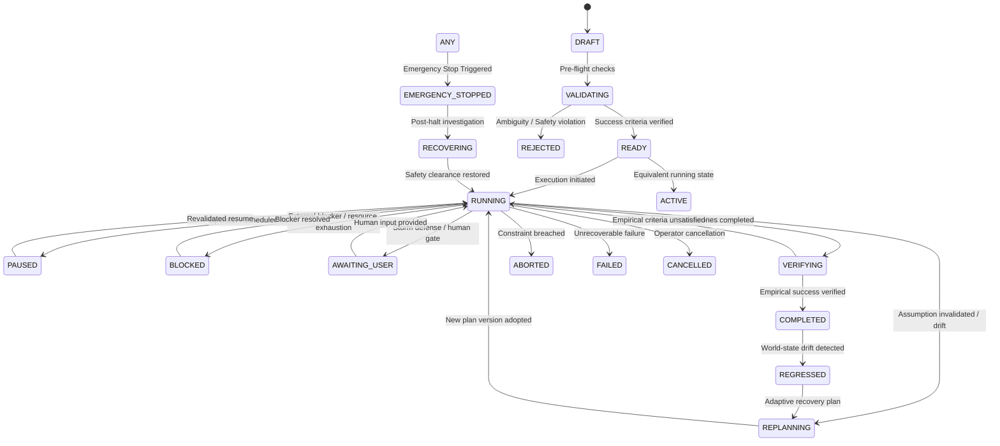
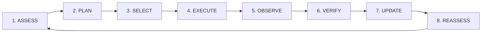

# KAIRO Autonomous Mission Control, Long-Horizon Execution & Continuous Objective Orchestration (Task 100)

## Executive Summary

Task 100 establishes **Autonomous Mission Control, Long-Horizon Execution & Continuous Objective Orchestration** as the persistent executive nervous system of KAIRO. In enterprise systems, long-running objectives take hours, days, or weeks. During this horizon, agents crash, sub-tasks fail, environments drift, third-party APIs change, and assumptions become invalid.

Mission Control bridges top-level strategic intent (`Goal`) with empirical reality, coordinating long-horizon execution through a closed-loop cybernetic supervisory cycle while preserving all subsystem authorities.

```
                    ┌──────────────────────────────────────────────┐
                    │           KAIRO MISSION CONTROL              │
                    │        Continuous Supervisory Cycle          │
                    └──────────────────────┬───────────────────────┘
                                           │
         ┌───────────────┬─────────────────┼─────────────────┬───────────────┐
         ▼               ▼                 ▼                 ▼               ▼
┌─────────────────┐ ┌─────────┐   ┌─────────────────┐ ┌─────────────┐ ┌─────────────┐
│  State Machine  │ │Milestone│   │Continuous Loop: │ │ Storm       │ │ Durable     │
│ 18 Valid States │ │ Engine  │   │ ASSESS ➔ PLAN   │ │ Defense     │ │ Checkpoints │
│ Fail-Closed     │ │ Evidence│   │ SELECT ➔ EXECUTE│ │ Circuit     │ │ & Zero-State│
│ EmergencyStop   │ │ DAG/Crit│   │ OBSERVE ➔ VERIFY│ │ Breakers    │ │ Handoff     │
│ Regression Supp │ │Path/Regr│   │ UPDATE ➔ REASSESS│ │ Loop Arrest │ │ Crash Recov │
└─────────────────┘ └─────────┘   └─────────────────┘ └─────────────┘ └─────────────┘
```

### Non-Negotiable Invariants Enforced

$$\mathbf{GOAL \neq MISSION \quad\mid\quad PLAN \neq MISSION}$$
$$\mathbf{WORK\ DONE \neq GOAL\ ACHIEVED \quad\mid\quad EXECUTION\ SUCCESS \neq VERIFIED\ SUCCESS}$$
$$\mathbf{COMPLETED\ STATE \neq PERMANENT\ STABILITY \quad\mid\quad AGENT\ OUTPUT \neq AUTHORITY}$$
$$\mathbf{AUTHORITY\ BINDING \neq ELEVATION \quad\mid\quad CONTEXT\ FRAGMENTATION \neq FORGETTING}$$
$$\mathbf{EMERGENCY\ STOP\ ALWAYS\ WINS}$$

---

## 1. Separation of Authorities

Mission Control is an **orchestrating, state-tracking, and coordinating layer**. It never usurps domain-specific authorities:

| Subsystem | Authority Domain | Task 100 Boundary & Invariant |
| :--- | :--- | :--- |
| **EmergencyStop** | Global emergency halt | **Absolute fail-closed gate**. If active, all mission cycles, tool executions, and state mutations abort immediately with status `EMERGENCY_STOPPED`. |
| **Planning Engine (`PlanningService`)** | Plan synthesis, task decomposition | **Sole planning authority**. Mission Control never invents plans directly; it requests plan synthesis and adaptation from `PlanningService`. |
| **Decision Intelligence (Task 94)** | Option selection, trade-off evaluation | **Sole choice authority**. Mission Control generates candidate actions; Decision Intelligence deliberates and selects the optimal path. |
| **Execution Governance (Task 95)** | Two-phase transaction commit (`ActionTransaction`) | **Sole execution authority**. Mission Control never invokes tools directly. All physical actions route through `ActionTransaction` with rollback support. |
| **World-State Reconciliation (Task 98)** | Empirical state verification & drift detection | **Sole reality truth authority**. `EXECUTION SUCCESS != VERIFIED SUCCESS`. Milestones and postconditions are verified only when confirmed by WorldState reconciliation. |
| **Situational Awareness (Task 99)** | Multi-signal fusion, situation tracking | **Sole awareness authority**. Mission Control ingests operational situations and links them to mission telemetry without bypassing signal correlation. |
| **SecurityCenter & Approvals** | Credentials, clearances, human-in-the-loop gates | **Sole authorization authority**. Missions cannot bypass approval registries or escalate autonomy without cryptographic authorization. |
| **Resource Economy** | Budget limits, token quotas, execution credits | **Sole resource authority**. Mission Control tracks consumed budgets and aborts or pauses missions when cost/duration limits are breached. |
| **Capability Lifecycle (Task 96)** | Tool/agent readiness and deprecation | **Sole capability authority**. Mission Control verifies capability health before assigning tasks to agents or tools. |

---

## 2. 18-State Mission Lifecycle State Machine

Missions progress through a strictly verified 18-state deterministic transition matrix:



### Complete State Definitions

1. `DRAFT`: Preliminary mission definition prior to validation.
2. `VALIDATING`: Objective normalization and ambiguity detection.
3. `READY`: Validated and authorized for autonomous execution.
4. `RUNNING`: Actively orchestrating sub-tasks and continuous loops.
5. `ACTIVE`: Synchronous running alias for legacy compatibility.
6. `PAUSED`: Temporarily suspended; non-destructive hold.
7. `BLOCKED`: Halted due to unmet dependency or external blocker.
8. `AWAITING_USER`: Awaiting human clarification or storm defense break.
9. `REPLANNING`: Invalidated plan under strategic re-synthesis.
10. `VERIFYING`: All actions done; empirically testing postconditions.
11. `COMPLETED`: Success criteria fully verified against WorldState.
12. `FAILED`: Terminal unrecoverable error.
13. `ABORTED`: Budget/constraint boundary violated.
14. `CANCELLED`: User or system manual cancellation.
15. `EMERGENCY_STOPPED`: Fail-closed global safety freeze.
16. `RECOVERING`: Post-incident recovery and audit validation.
17. `DEGRADED`: Progressing under impaired subsystem capacity.
18. `REGRESSED`: Previously completed milestone/objective regressed due to environmental drift.

---

## 3. The Continuous Orchestration Loop

Autonomous Mission Control executes a cybernetic 8-phase loop:



### Phase Protocol
1. **ASSESS**: Probe global `EmergencyStop` (fail-closed). Retrieve latest active situations from Task 99 and entity state from Task 98.
2. **PLAN**: Check plan staleness and assumption validity. If stale or invalidated, invoke `PlanningService` to generate a new immutable `MissionPlanVersion`.
3. **SELECT**: Deliberate via `DecisionIntelligence` across available action candidates, respecting authority scopes (`AUTONOMOUS`, `SUPERVISED`, `MANUAL`).
4. **EXECUTE**: Route proactive remediation or operational steps through `ActionTransaction` with preflight validation and compensations.
5. **OBSERVE**: Collect post-action telemetry, output tokens, logs, and sensor observations.
6. **VERIFY**: Verify expected postconditions against empirical `WorldState` truth (`POSTCONDITION != ASSUMED`).
7. **UPDATE**: Calculate multi-metric progress, update DAG readiness, detect regressions (`COMPLETED -> REGRESSED`), and compute 10D health.
8. **REASSESS**: Audit assumption validity, check storm defense circuit breakers, and commit durable checkpoint.

---

## 4. Milestone Engine & Evidence-Based Progress

Missions enforce: **PROGRESS != SUCCESS** and **WORK DONE != OBJECTIVE ATTAINED**.

### Milestone Verification
- A milestone is only marked `COMPLETED` when accompanied by empirical evidence:
  - WorldState attribute check (e.g. `cluster_status == "HEALTHY"`).
  - Integration test suite pass confirmation.
  - Telemetry threshold satisfaction (e.g. `p99_latency < 120ms`).
- Milestones without verified evidence remain in `VERIFYING` or `PENDING`.

### Progress Regression
Environmental drift or downstream side-effects can break previously accomplished states:
- If an empirical check fails for a previously completed milestone, the milestone transitions to `REGRESSED`.
- Mission overall progress percentage drops proportionally:

$$\text{Progress} = \frac{\sum_{m \in \text{Completed Milestones}} \text{Weight}_m}{\sum_{m \in \text{All Milestones}} \text{Weight}_m} \times (1.0 - \text{Drift Penalty})$$

- If a regressed milestone is on the **Critical Path**, mission status immediately transitions to `REGRESSED` or `REPLANNING`.

---

## 5. Dynamic Replanning, Assumption Cascades & Storm Defense

### Cascading Assumption Invalidation
1. Operational assumptions (e.g., `Database read-replica exists and is online`) are continuously checked against Task 98 WorldState and Task 99 Situational Awareness.
2. If an assumption's validity score falls below threshold ($< 0.50$):
   - Assumption marked `INVALIDATED`.
   - All dependent milestones in the DAG are immediately marked `INVALIDATED` or `BLOCKED`.
   - The active plan version is marked `STALE`.
   - Strategic replan is triggered.

### Immutable Plan Versions
- Every replan generates an immutable `MissionPlanVersion` ($v_1, v_2, \dots, v_n$).
- The history records:
  - Triggering reason (e.g., assumption invalidation, blocker, user request).
  - Associated decision ID from Decision Intelligence.
  - Timestamp, author, and differential task changes.

### Mission Storm Defense (Circuit Breakers)
To prevent infinite replanning and thrashing loops when an environment is unstable:
1. **Replan Storm Breaker**: Maximum 3 replans within a 5-minute sliding window. Exceeding this halts autonomous replanning and moves mission to `AWAITING_USER`.
2. **Failure Streak Breaker**: Maximum 4 consecutive action failures. Exceeding this arrests execution and alerts the human operator.
3. **Budget Breaker**: Consumed cost > budget limit triggers immediate graceful `PAUSED` or `ABORTED`.

---

## 6. 10-Dimensional Health Matrix

Health is evaluated deterministically across 10 empirical dimensions:

| Dimension | Meaning | Degraded Threshold |
| :--- | :--- | :--- |
| `objective_drift` | Semantic divergence between current actions and primary goal | $< 0.70$ |
| `assumption_validity` | Ratio of valid operational assumptions | $< 0.60$ |
| `milestone_progress_velocity` | Actual progress velocity vs scheduled timeline | $< 0.50$ |
| `failure_rate` | Exponential moving average of step execution failures | $> 0.25$ |
| `dependency_blockage` | Fraction of blocked external dependencies | $> 0.20$ |
| `budget_burn_vs_progress` | Ratio of budget consumed to progress accomplished | $> 1.50$ |
| `plan_staleness` | Time elapsed since last plan re-evaluation | $> 72\text{ hours}$ |
| `risk_exposure` | Aggregate severity score of active open risks | $> 0.65$ |
| `verification_lag` | Delay between action completion and empirical verification | $> 30\text{ minutes}$ |
| `agent_cohesion` | Consensus and coordination score among active subagents | $< 0.60$ |

### Deterministic Health Classification
- `ON_TRACK`: All 10 dimensions $\ge 0.75$, no active blockers.
- `AT_RISK`: Any dimension $< 0.70$ or budget burn elevated.
- `DEGRADED`: Multiple dimensions $< 0.50$ or high failure rate.
- `BLOCKED`: Active severe blocker or unresolved dependency.
- `CRITICAL`: Invariant breach, drift $\ge 0.80$, or critical path failure.

---

## 7. Durable Checkpoints, Crash Recovery & Zero-Hidden-State Handoff

Long-horizon missions must survive process termination, machine reboot, network failure, or agent crash.

### Durable Checkpointing
At every major milestone or supervisory cycle:
- Mission entity, health dimensions, DAG state, assumptions, and audit trail are committed to relational storage (`MissionModel`, `MissionMilestoneModel`, `MissionAssumptionModel`, `MissionPlanVersionModel`).
- Cryptographic SHA-256 hash chains verify record integrity.

### Zero-Hidden-State Handoff
When handing off an objective to a newly spawned agent or resuming after a crash:
- Checkpoints include a **Handoff Manifest**:
  - `mission_id`, `objective`, `active_plan_id`.
  - `completed_milestones` with verified empirical evidence.
  - `remaining_milestones` with DAG dependencies.
  - `active_assumptions` and current validity scores.
  - `resource_utilization` (budget spent vs remaining).
  - `provenance` and audit trail linkage.
- The receiving agent requires **zero implicit memory** to continue execution without repeating work or violating constraints.

---

## 8. Verification & Test Suite

The architecture is covered by comprehensive tests and verification scripts:
- `backend/tests/test_missions_service_and_api.py` (8/8 passing)
- `backend/tests/test_missions_blockers_and_recovery.py` (4/4 passing)
- `backend/tests/test_missions_hierarchy_and_dag.py` (7/7 passing)
- `backend/tests/test_missions_safety_and_audit.py` (5/5 passing)
- `backend/tests/test_missions_supervisory_and_escalation.py` (6/6 passing)
- `backend/tests/test_missions_verification_and_drift.py` (6/6 passing)
- `frontend/tests/missions.test.js` (5/5 passing)
- `backend/tests/test_mission_control.py` (Task 100 new comprehensive tests)
- `scripts/verify_mission_control_e2e.py` (8 deterministic end-to-end operational scenarios)
