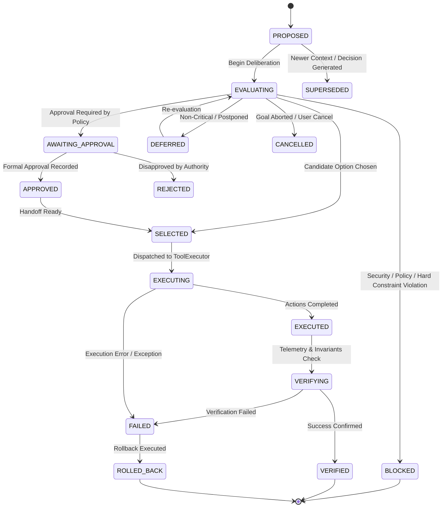

# KAIRO Autonomous Decision Intelligence, Policy-Aware Action Selection, Option Evaluation & Decision Memory Engine (Task 94)

## 1. Core Mandate & Epistemic Boundaries

The **Decision Intelligence Engine** is Kairo's operational deliberation substrate. It transforms multi-source evidence, forecasts, causal models, risks, resource budgets, capability lifecycle states, governance constraints, and historical decision outcomes into **structured, explainable, and policy-aware action recommendations or explicit non-interventions**.

### Non-Negotiable Axioms

$$\mathbf{DECISION \neq AUTHORIZATION \quad\mid\quad DECISION \neq POLICY}$$
$$\mathbf{DECISION \neq PLANNING \quad\mid\quad DECISION \neq EXECUTION}$$
$$\mathbf{MODEL\ OUTPUT \neq AUTHORITY \quad\mid\quad FORECAST \neq FACT}$$
$$\mathbf{SIMULATION \neq REALITY \quad\mid\quad HISTORICAL\ DECISION \neq CURRENT\ DECISION}$$
$$\mathbf{CONFIDENCE \neq CERTAINTY \quad\mid\quad NO\_ACTION\ IS\ A\ VALID\ OPTION}$$
$$\mathbf{UNKNOWN\ MUST\ REMAIN\ UNKNOWN \quad\mid\quad STALE\ DECISION\ MUST\ NOT\ EXECUTE}$$
$$\mathbf{EMERGENCY\ STOP\ ALWAYS\ WINS}$$

---

## 2. Architectural Separation of Powers

Decision Intelligence coordinates existing authoritative subsystems without duplicating them:

| Subsystem | Authority & Responsibility | Decision Intelligence Relationship |
| :--- | :--- | :--- |
| **Planner** | Generates candidate task decompositions and execution plans | Consumes planner outputs as candidate decision options |
| **Decision Intelligence** | Evaluates options, trade-offs, risks, constraints; selects action or NO-ACTION | **The Deliberation Layer** (Advisory & Decisional Selection) |
| **Governance Engine** | Determines constitutional policy and prohibited actions | Informs decision gates; policy violations become BLOCKED |
| **SecurityCenter** | Authorizes actors, tools, and capability boundaries | Sole authorization authority; denied options are BLOCKED |
| **ApprovalRegistry** | Issues formal human and institutional approvals | Suspends decision in `AWAITING_APPROVAL` until approved |
| **Resource Economy** | Allocates compute, memory, bandwidth, and model budgets | Informs resource feasibility; exhausted budgets penalize/block |
| **Capability Lifecycle** | Validates capability versions, canary states, and retirement | Verifies candidate options only reference valid capability versions |
| **Simulation / Digital Twin** | Runs counterfactual drills and recovery simulations | Evaluates high-risk or irreversible options before selection |
| **ToolExecutor** | Executes authorized tools in native Rust sandboxes | Receives approved decision hand-offs; executes side effects |
| **Knowledge Consolidation** | Persists consolidated semantic memory with provenance | Records structured decision rationale and outcomes for learning |

---

## 3. Decision Lifecycle State Machine

---

## 4. Multi-Criteria Trade-Offs & Pareto Analysis

Rather than collapsing multidimensional concerns into a misleading single scalar score, options are evaluated along explicit Pareto axes:
1. **Objective Alignment**: Degree of satisfaction of the primary strategic goal.
2. **Risk Exposure**: Worst-case downside, blast radius, and failure probability.
3. **Reversibility**: Effort and feasibility to undo the action if outcomes deviate.
4. **Resource Cost**: CPU, RAM, tokens, financial expenditure.
5. **Time Horizon**: Latency to completion.
6. **Epistemic Certainty**: Proportion of observed vs. inferred or speculative evidence.

Options are identified as **dominated** or **non-dominated (Pareto frontier)**, exposing explicit trade-offs (e.g., Option A is faster but irreversible; Option B is slower but zero-risk).

---

## 5. Decision Memory & Provenance Tracking

Historical decisions are consolidated through Task 92's Memory Consolidation infrastructure. 
Every decision records:
- Context reference snapshot
- Alternatives considered and why rejected
- Critical assumptions and their validity
- Predicted vs. actual outcomes
- Verification status and lessons learned

When historical decisions are queried for reuse, a strict environmental and policy drift check is performed. If capability versions, resource limits, or governance policies have changed, the historical decision is designated `REFERENCE_ONLY` and cannot be blindly replayed.
