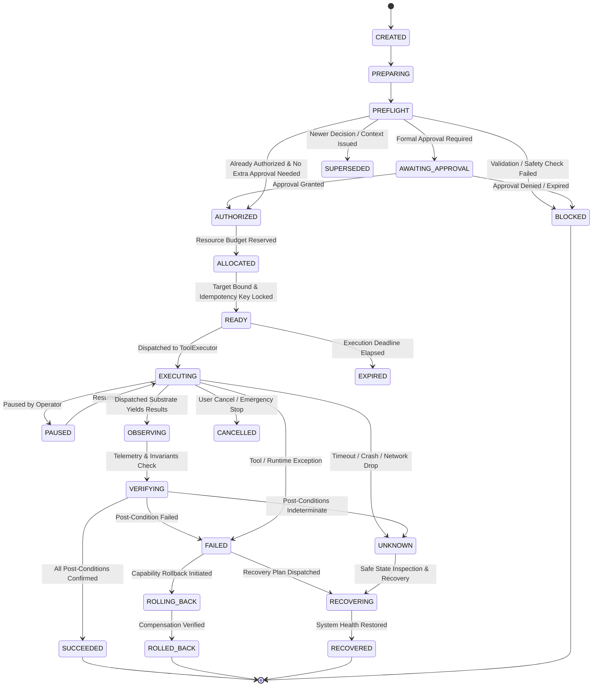

# KAIRO Autonomous Execution Governance, Action Transaction, Pre-Flight Validation, Commit/Rollback & Verified Outcome Engine (Task 95)

## 1. Core Mandate & Cognitive Boundary

Task 94 established structured Decision Intelligence (the deliberation layer).
**Task 95 establishes the execution governance boundary** — the authoritative, transaction-like orchestration layer that sits between a deliberate decision and low-level execution substrates.

### Non-Negotiable Cognitive Axioms

$$\mathbf{REQUESTED\ ACTION \neq STARTED\ ACTION \quad\mid\quad STARTED\ ACTION \neq COMPLETED\ ACTION}$$
$$\mathbf{COMPLETED\ ACTION \neq SUCCESSFUL\ OUTCOME \quad\mid\quad SUCCESSFUL\ OUTCOME \neq VERIFIED\ OUTCOME}$$
$$\mathbf{DECISION \neq EXECUTION \quad\mid\quad AUTHORIZATION \neq APPROVAL \quad\mid\quad APPROVAL \neq EXECUTION}$$
$$\mathbf{UNKNOWN \neq SUCCESS \quad\mid\quad UNKNOWN \neq FAILURE}$$
$$\mathbf{CANCELLATION \neq NOTHING\ HAPPENED \quad\mid\quad TIMEOUT \neq NOTHING\ HAPPENED}$$
$$\mathbf{ROLLBACK\ IS\ AN\ ACTION \quad\mid\quad RECOVERY\ IS\ AN\ ACTION}$$
$$\mathbf{EMERGENCY\ STOP\ ALWAYS\ WINS}$$

---

## 2. Separation of Authorities

The Execution Governance Engine coordinates execution without usurping or duplicating existing authoritative subsystems:

| Subsystem | Authority & Responsibility | Execution Governance Relationship |
| :--- | :--- | :--- |
| **Execution Governance Engine** | Action transaction lifecycle, pre-flight gate, parameter/target binding, idempotency, observation capture, postcondition verification, compensation sequencing | **The Execution Orchestration Layer** |
| **Decision Intelligence (Task 94)** | Option deliberation, Pareto trade-offs, action selection, outcome memory | Produces originating `DecisionV2Record`; receives execution & verification outcome feedback |
| **ToolExecutor & Native Substrate** | Low-level capability execution, Python sandbox, Rust worker execution, computer interaction | Executes authorized commands upon transaction dispatch; yields raw `ToolResult` |
| **SecurityCenter (Task 3)** | Actor authentication, permission level classification, capability boundaries | Sole authorization authority; revalidated at pre-flight |
| **Governance Engine (Task 36)** | Constitutional policies, prohibited action classification, environmental rules | Revalidated at pre-flight; policy violations transition transaction to `BLOCKED` |
| **ApprovalRegistry** | Formal human and institutional authorizations | Verifies approval scope, timestamp, non-revocation before execution |
| **Resource Economy (Task 57)** | CPU, memory, tokens, concurrency, storage, and network allocations | Grants resource reservation token before execution; rejects over-budget actions |
| **Capability Lifecycle (Task 91)** | Capability versioning, canary phases, deprecation, retirement | Validates capability existence, version, compatibility, and health state |
| **System State Graph (Task 93)** | Internal operational model, digital twin, dependency relationships | Supplies target context, verifies environmental preconditions & post-conditions |
| **Recovery & Resilience (Task 76/90)** | Multi-strategy recovery planning, circuit breakers, quarantine, self-healing | Coordinates recovery path if execution or verification fails |
| **Knowledge Consolidation (Task 92)** | Long-term memory consolidation, operational lessons learned | Ingests verified transaction outcomes and post-mortem lessons |
| **EmergencyStop (Task 3)** | Process kill-switch, immediate side-effect termination | Overrides all executing actions fail-closed immediately |

---

## 3. Transaction Lifecycle State Machine

The transaction state machine enforces 22 explicit states across the operational lifecycle:

---

## 4. Pre-Flight Validation Matrix (18 Gates)

Before dispatching an execution request to `ToolExecutor`, the transaction must pass all 18 pre-flight gates:

1. **Decision Currency**: Originating `decision_id` exists and is fresh.
2. **Decision Freshness**: Decision `valid_until` has not expired (`is_stale == False`).
3. **Decision Non-Supersession**: Originating decision status is `SELECTED` or `APPROVED` (not `SUPERSEDED` or `CANCELLED`).
4. **Active Objective**: Strategic goal remains active in System State Graph.
5. **Context Congruence**: Environment context has not drifted materially.
6. **Capability Existence**: Capability is registered in Capability Lifecycle Engine.
7. **Capability Version Usability**: Capability version is `ACTIVE` or `CANARY` (never `RETIRED` or `BLOCKED`).
8. **Dependency Availability**: Required runtime dependencies, connection pools, and devices are operational.
9. **Security Revalidation**: Authoritative SecurityCenter check re-verifies user permission level and target scope.
10. **Governance Revalidation**: Governance Policy Engine confirms non-prohibition under current active rules.
11. **Approval Verification**: ApprovalRegistry confirms active, unexpired, non-revoked approval for exact target and action.
12. **Resource Reservation**: Resource Economy grants temporary reservation token for CPU, memory, and tokens.
13. **EmergencyStop Inactive**: Global and user emergency stops are verified disengaged.
14. **Parameter Schema Validity**: Arguments strictly conform to typed tool schema (no prohibited extra fields or type coercion).
15. **Target Binding Validity**: Target entity (file, container, database, workflow, machine) exists and is reachable.
16. **Idempotency Satisfaction**: Idempotency key verified; duplicate executions return prior cached transaction.
17. **Rollback / Recovery Path**: If action is mutating and marked reversible, compensation action and permissions are confirmed.
18. **Simulation Freshness**: If simulation was mandated by Decision Intelligence, simulation state is `PASSED` and unexpired.

---

## 5. Observation vs. Verification vs. Outcome

A critical flaw in autonomous systems is conflating low-level execution with desired outcome:
- **Observation**: Empirical telemetry captured during and immediately after execution (return code, HTTP status, process exit code, stdout/stderr, execution latency).
- **Post-Condition Verification**: Independent inspection of the target environment to confirm reality conforms to expectations (e.g. verifying a file actually exists with expected hash, verifying a service is healthy and responding to probes, checking DB row count).
- **Stability Window**: Waiting a configured duration (e.g., 5s to 60s) post-execution to verify that transient side effects do not crash the system.
- **Outcome Classification**:
  - `FULL_SUCCESS`: Tool succeeded and 100% of post-conditions verified.
  - `PARTIAL_SUCCESS`: Multi-target action where some targets succeeded and others failed/skipped (explicit per-target outcomes recorded).
  - `FAILED`: Execution threw an error or post-conditions were definitively violated.
  - `UNKNOWN`: Network drop, process crash, or timeout occurred; outcome cannot be proven without safe state inspection.
