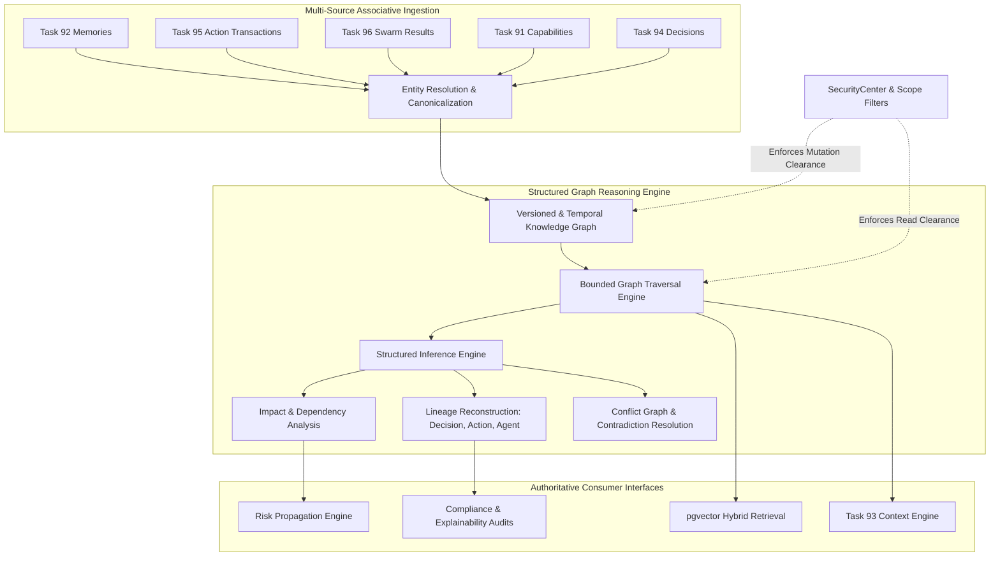

# KAIRO Autonomous Knowledge Graph Reasoning, Graph Memory, Relationship Intelligence & Structured Inference Engine (Task 97)

## Executive Summary

Task 97 upgrades KAIRO's existing knowledge graph infrastructure into a production-grade, structured reasoning substrate. It enables causal, temporal, provenance-backed relationship intelligence across memories, goals, plans, capabilities, decisions, action transactions, multi-agent swarms, and runtime systems.

### Core Non-Negotiable Axioms Enforced

$$\mathbf{GRAPH \neq TRUTH \quad\mid\quad RELATIONSHIP \neq FACT \quad\mid\quad RELATIONSHIP \neq CAUSALITY}$$
$$\mathbf{INFERENCE \neq OBSERVATION \quad\mid\quad CONNECTIVITY \neq IMPORTANCE \quad\mid\quad VECTOR\ SIMILARITY \neq TRUTH}$$
$$\mathbf{GRAPH\ PATH \neq PROOF \quad\mid\quad AGENT\ OUTPUT \neq AUTHORITY \quad\mid\quad MEMORY \neq AUTHORIZATION}$$
$$\mathbf{GRAPH \neq AUTHORIZATION \quad\mid\quad GRAPH \neq GOVERNANCE \quad\mid\quad GRAPH \neq RESOURCE\ ALLOCATION}$$
$$\mathbf{SECURITYCENTER\ REMAINS\ THE\ ONLY\ AUTHORIZATION\ AUTHORITY}$$
$$\mathbf{GOVERNANCE\ REMAINS\ THE\ POLICY\ AUTHORITY}$$
$$\mathbf{APPROVALREGISTRY\ REMAINS\ THE\ APPROVAL\ AUTHORITY}$$
$$\mathbf{RESOURCE\ ECONOMY\ REMAINS\ THE\ RESOURCE\ AUTHORITY}$$
$$\mathbf{EMERGENCY\ STOP\ ALWAYS\ WINS}$$

---

## 1. Separation of Authorities

The graph is a **reasoning substrate and associative index**. It is **never** an authorization or policy authority.

| Domain | Authoritative Subsystem | Graph Role & Boundary |
| :--- | :--- | :--- |
| **Authorization & Scoping** | SecurityCenter | Authoritative for actor clearances and resource access; filters graph traversals to prevent side-channel leakage. |
| **Constitutional Policy** | Governance Engine (`PolicyEngine`) | Hard safety constraints; graph relationships can never override safety rules or external boundaries. |
| **Human Approvals** | ApprovalRegistry | Sole authority for gating actions; graph can explain why an approval is required, but cannot grant it. |
| **Action Execution** | Action Transactions (Task 95) | Real-world side effects require an `ActionTransaction`; graph models past actions and structural bindings. |
| **Decision Intelligence** | Decision Intelligence (Task 94) | Deliberates and selects options; graph provides dependency impact, lineage, and historical precedents. |
| **Multi-Agent Workers** | Swarm Orchestration (Task 96) | Executes tasks; graph records agent output lineages and evidence without exposing private scratchpads. |
| **Memory Consolidation** | Memory Consolidation (Task 92) | Reconciles episodic/semantic facts; graph links memories to source evidence and records contradictions. |
| **Context Synthesis** | Context Engineering (Task 93) | Assembles bounded prompt context; graph provides ranked, bounded associative context expansions. |
| **Risk & Causal Analysis** | Risk & Causal Engines (Task 88–90) | Computes risk scores and causal probabilities; graph provides topological structure and explicit causal edges. |
| **Emergency Halt** | `EmergencyStopService` | Absolute fail-closed switch; immediately blocks mutating graph queries or active traversals. |

---

## 2. Graph Reasoning Architecture

---

## 3. Node & Edge Semantics

### Node Types
- `PERSON_CONTEXT`, `USER`, `PERSON`, `ORGANIZATION`, `PROJECT`
- `TASK`, `GOAL`, `DECISION`, `ACTION`, `WORKFLOW`
- `CAPABILITY`, `CAPABILITY_VERSION`, `TOOL`, `SERVICE`, `RESOURCE`
- `MEMORY`, `KNOWLEDGE`, `EVIDENCE`, `DOCUMENT`, `FILE`, `REPOSITORY`
- `EVENT`, `INCIDENT`, `AGENT`, `SYSTEM`, `EXTERNAL_ENTITY`
- `HYPOTHESIS`, `ASSUMPTION`, `OBSERVATION`

### Edge Relationships
- **Structural**: `PART_OF`, `CHILD_OF`, `PARENT_OF`, `RELATED_TO`, `CONTAINS`
- **Dependencies**: `DEPENDS_ON`, `USED_BY`, `REQUIRES`, `BLOCKS`, `BLOCKED_BY`, `TRANSITIVELY_DEPENDS_ON`
- **Lifecycle & Derivation**: `IMPLEMENTS`, `DERIVED_FROM`, `SUPERSEDES`, `REPLACED_BY`, `RECOVERED_BY`
- **Evidence & Truth**: `SUPPORTS`, `CONTRADICTS`, `EVIDENCE_FOR`, `ASSUMES`, `VALIDATES`, `INVALIDATES`
- **Causality & Execution**: `CAUSES`, `RESULTS_IN`, `AFFECTS`, `EXECUTED_BY`, `DECIDED_BY`, `PLANNED_BY`, `ALLOCATED_FROM`

---

## 4. Epistemic Certainty & Provenance

To prevent silent conversion of inferences or assumptions into authoritative facts, all nodes and edges track:

### Certainty Taxonomy
1. `KNOWN`: Empirically verified or direct authoritative source with zero contradictions.
2. `LIKELY`: High-confidence observation or multi-evidence correlation ($confidence \ge 0.8$).
3. `POSSIBLE`: Plausible hypothesis or single uncorroborated report ($0.5 \le confidence < 0.8$).
4. `UNCERTAIN`: Conflicted evidence, stale timestamp, or speculative assertion ($confidence < 0.5$).
5. `CONTRADICTED`: Directly refuted by newer empirical evidence or opposing proof.
6. `UNKNOWN`: Insufficient information to assess truth status.

### Provenance Classifications
- `OBSERVED`: Directly witnessed via physical sensor, system telemetry, or tool response.
- `INFERRED`: Derived via a formal, bounded deductive graph rule.
- `DERIVED`: Synthesized from parent memories or aggregated reports.
- `MODEL_GENERATED`: Proposed by an LLM or reasoning model (unverified).
- `EXTERNALLY_SOURCED`: Ingested from a third-party API or document.
- `SYSTEM_VERIFIED`: Cryptographically or deterministically proven by Kairo core.

---

## 5. Structured Inference Rules

Inference is bounded, deterministic, and preserves parents:

1. **Transitive Dependency**:
   $$\forall A, B, C: (A \xrightarrow{\text{DEPENDS\_ON}} B) \land (B \xrightarrow{\text{DEPENDS\_ON}} C) \implies A \xrightarrow[\text{rule: TRANS\_DEP}]{\text{TRANSITIVELY\_DEPENDS\_ON}} C$$
2. **Structural Composition (`PART_OF`)**:
   $$\forall A, B, C: (A \xrightarrow{\text{PART\_OF}} B) \land (B \xrightarrow{\text{PART\_OF}} C) \implies A \xrightarrow[\text{rule: TRANS\_PART}]{\text{PART\_OF}} C$$
3. **Block Propagation**:
   $$\forall A, B, C: (A \xrightarrow{\text{BLOCKS}} B) \land (C \xrightarrow{\text{DEPENDS\_ON}} B) \implies A \xrightarrow[\text{rule: BLOCKS\_PROP}]{\text{AFFECTS}} C$$
4. **Invalidation Propagation**:
   $$\forall A, B, C: (A \xrightarrow{\text{CONTRADICTS}} B) \land (B \xrightarrow{\text{SUPPORTS}} C) \implies A \xrightarrow[\text{rule: WEAKEN\_CLAIM}]{\text{INVALIDATES}} (B \to C)$$

Each inferred edge records:
- `derivation_rule`: Unique rule identifier.
- `parent_edge_ids`: List of primary edges that justified the deduction.
- `confidence`: Compounded confidence ($c_{derived} = \prod c_{parents} \times \text{decay}$).
- `derivation_timestamp`: UTC timestamp of generation.

---

## 6. Graph Query & Traversal Limits

To guarantee deterministic latency and prevent graph combinatorial explosions:
- **Max Depth**: Traversal is bounded at $\le 5$ hops by default.
- **Max Nodes**: Bounded at $\le 200$ nodes per query.
- **Max Edges**: Bounded at $\le 500$ edges per query.
- **Max Execution Time**: Query timeout enforced at 3.0 seconds.
- **Branching Factor**: Max 25 edges per node expansion.
