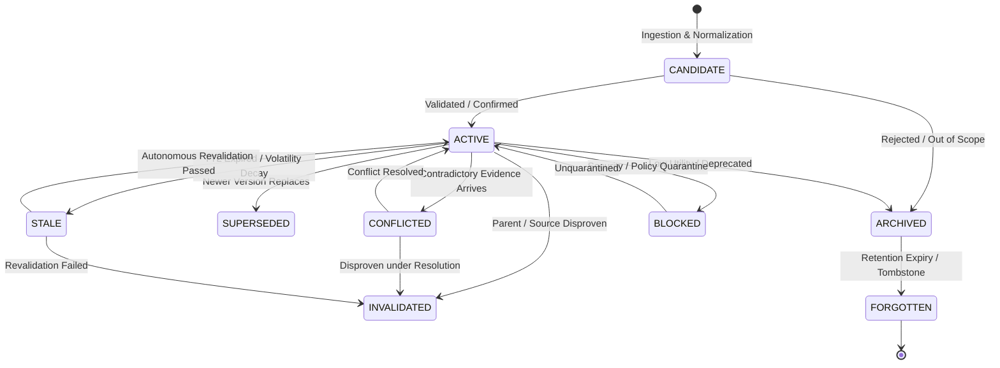

# KAIRO Autonomous Knowledge Consolidation, Memory Reconstruction, Conflict Resolution & Context Evolution Engine

## Phase 0: Repository-First Audit & System Integration

### 1. Executive Summary & Non-Negotiable Cognitive Invariants
KAIRO must maintain a trustworthy, evolving, auditable, time-aware knowledge state. The core cognitive invariants governing this subsystem are:

$$\mathbf{MEMORY \neq TRUTH \quad\mid\quad VECTOR\ SIMILARITY \neq TRUTH \quad\mid\quad MODEL\ OUTPUT \neq FACT}$$
$$\mathbf{RECENCY \neq TRUTH \quad\mid\quad CONFIDENCE \neq CERTAINTY \quad\mid\quad INFERENCE \neq OBSERVATION}$$
$$\mathbf{HYPOTHESIS \neq BELIEF \quad\mid\quad BELIEF \neq VERIFIED\ FACT}$$

When evidence conflicts, the system must **preserve the conflict** rather than silently overwriting or hallucinating consensus. When evidence is insufficient, the system must report **UNKNOWN**. When information becomes stale, it must be marked **STALE**. When parent knowledge is invalidated, invalidation must cascade through derived knowledge.

---

### 2. Audit of Existing Subsystems & Non-Duplication Guarantees

| Subsystem | Existing Repository Component | Integration & Extension Strategy (Task 92) | Non-Ownership Guarantee |
| :--- | :--- | :--- | :--- |
| **Durable Memory Storage** | `backend/app/memory/models.py` (`Memory`, `Conversation`, `Message`), `backend/app/memory_consolidation/models.py` (`DurableMemoryModel`) | Extend `DurableMemoryModel` with Task 92 fields (`certainty`, `volatility`, `next_validation_at`). Link long-term memories with structured entities. | **No 2nd Memory Store**: All durable entities persist in unified tables (`durable_memories`, `memories`). |
| **Knowledge Graph** | `backend/app/knowledge_graph/models.py` (`NodeModel`, `EdgeModel`, `AssertionModel`, `ContradictionModel`) | Bridge memory consolidation directly to `NodeModel` and `EdgeModel`. Map semantic relations (`SUPPORTS`, `CONTRADICTS`, `SUPERSEDES`, `DERIVED_FROM`, `DEPENDS_ON`, `RELATED_TO`, `TEMPORALLY_PRECEDES`, `CAUSES`, `RESULTS_IN`, `APPLIES_TO`). | **No 2nd Knowledge Graph**: All graph vertices and edges remain in `kg_nodes` and `kg_edges`. |
| **Vector Index & Embeddings** | `backend/app/memory/embeddings.py`, pgvector `memories.embedding` (1536-dim) | Reuse existing embedding service. Store metadata filters (`type`, `status`, `confidence`, `freshness`, `scope`, `sensitivity`) on vector search queries to exclude invalidated/forgotten records. | **No 2nd Vector DB**: Vector similarity operations run through existing pgvector index. Vector similarity alone NEVER determines truth. |
| **Retrieval & Context Assembly** | `backend/app/context/resolver.py`, `backend/app/context/orchestrator.py`, `backend/app/memory_consolidation/retrieval.py` | Extend context assembly to filter stale/invalidated knowledge, rank by importance/confidence/freshness, and **explicitly surface unresolved contradictions** to reasoning prompts. | **No 2nd Retrieval Engine**: Context assembly layers build on unified context resolvers. |
| **Attention Engine** | `backend/app/attention/service.py`, `backend/app/attention/importance.py` | Provide importance, novelty, and contradiction signals directly to `AttentionService`. Memory importance feeds into cognitive resource allocation. | **No 2nd Attention Engine**: Memory signals augment existing attention priorities. |
| **Authorization & Security** | `backend/app/security/center.py` (`SecurityCenter`), `backend/app/security/emergency_stop.py` (`EmergencyStopService`) | All memory operations are categorized (`READ`, `WRITE`, `EXTERNAL`, `DESTRUCTIVE`, `EXECUTE`). EmergencyStop unconditionally halts autonomous mutations, bulk forgetting, and revalidations fail-closed. | **Single Security Authority**: SecurityCenter remains the sole gatekeeper. Untrusted memory is DATA, never authority. |
| **Governance & Approvals** | `backend/app/policy/governance/`, `backend/app/security/approvals.py` (`ApprovalManager`) | Bulk memory forgetting, destructive purges, and cross-scope migrations require human approval through existing `ApprovalManager`. | **Single Policy Authority**: Governance/Constitution policies govern memory lifecycle. |
| **Canonical Event Bus** | `backend/app/events/bus.py`, `backend/app/events/registry.py` | Register and emit canonical memory lifecycle events (`memory.candidate_created`, `memory.activated`, `memory.conflicted`, `memory.conflict_resolved`, `memory.revalidated`, etc.) with correlation IDs and audit metadata. | **Single Event Bus**: Outbox pattern and canonical schema validation preserved. |
| **Capability & Reliability Intelligence** | `backend/app/capability_lifecycle/` (Task 91), `backend/app/reliability_intelligence/` (Task 90) | Changes in capability versions, deprecations, or tool health failures trigger autonomous revalidation candidates for dependent procedural memories. | **Single Lifecycle/Reliability Substrate**: Autonomous revalidation candidate generation listens to existing capability/incident events. |

---

### 3. Ontological Taxonomy: Distinguishing Cognitive Artifacts

| Category | Semantic Definition | Mutability | Epistemological Status |
| :--- | :--- | :--- | :--- |
| **EVENT** | An immutable, timestamped occurrence in the environment or agent runtime. | Immutable | Observed phenomenon; cannot be altered retroactively. |
| **RAW_OBSERVATION** | Direct sensory or textual capture prior to normalization or semantic evaluation. | Immutable | Unverified input stream. |
| **EPISODIC** | Concrete experience or task outcome situated in time and context. | Versioned | Situational memory; subject to decay or consolidation. |
| **SEMANTIC** | Generalized, cross-situational concept, fact, or principle abstracted from episodes. | Versioned | Structured knowledge with supporting evidence DAG. |
| **PROCEDURAL** | Actionable recipe or workflow describing how to accomplish a task (prerequisites, steps, failure conditions). | Versioned | Validated procedure; linked to capability execution records. |
| **CONTEXTUAL / PREFERENCE** | Transient or long-term operational constraints, user preferences, and working state. | Volatile / Scoped | Subject to explicit user override, scoping, and TTL decay. |
| **HYPOTHESIS** | Proposed explanation or tentative model claim requiring empirical verification. | In Flux | **NEVER a verified fact**; states: `PROPOSED`, `SUPPORTED`, `WEAKENED`, `CONTRADICTED`, `VERIFIED`, `REJECTED`, `EXPIRED`. |
| **BELIEF** | Internal working assumption adopted under uncertainty to guide decisions. | Dynamic | Marked as subjective belief; explicit confidence boundary. |
| **DERIVED FACT** | Knowledge inferred from parent memories through logical deduction or synthesis. | Versioned | Invalidates automatically when parent facts are invalidated or stale. |
| **EVIDENCE** | Grounding artifact (citation, tool output, user assertion, system verification) that supports, contradicts, or qualifies a memory. | Immutable link | Preserves competing viewpoints; never averaged away. |

---

### 4. Memory Lifecycle State Machine



### 5. Architectural Pipeline

```
RAW INPUT (User, Tool, Capability, Telemetry, External)
   │
   ▼
[Normalization & Secret Scrubbing]
   │
   ▼
[Extraction & Cognitive Classification]
   │
   ▼
[Semantic & Exact Deduplication] ──(Match)──► [Merge Evidence & Provenance]
   │ (Novel)
   ▼
[Conflict Detection Engine] ────(Conflict)──► [Mark CONFLICTED & Record Pair]
   │ (No Conflict)
   ▼
[Importance Assessment (Attention Engine)]
   │
   ▼
[Retention Decision & Persistence (Durable Memory + KG Node)]
   │
   ▼
[Vector Indexing (pgvector) + Graph Edge Materialization]
   │
   ▼
[Context Assembly & Memory Reconstruction Surfaces]
```
