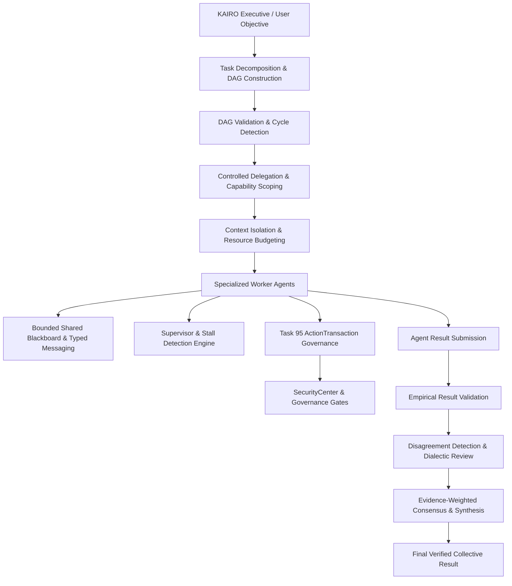
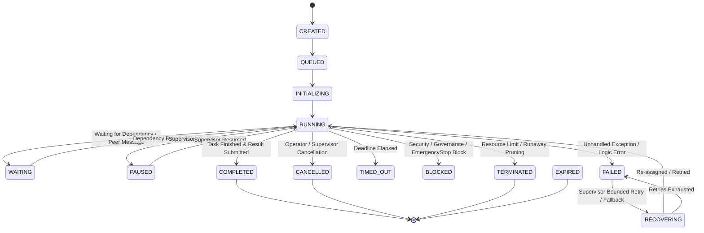
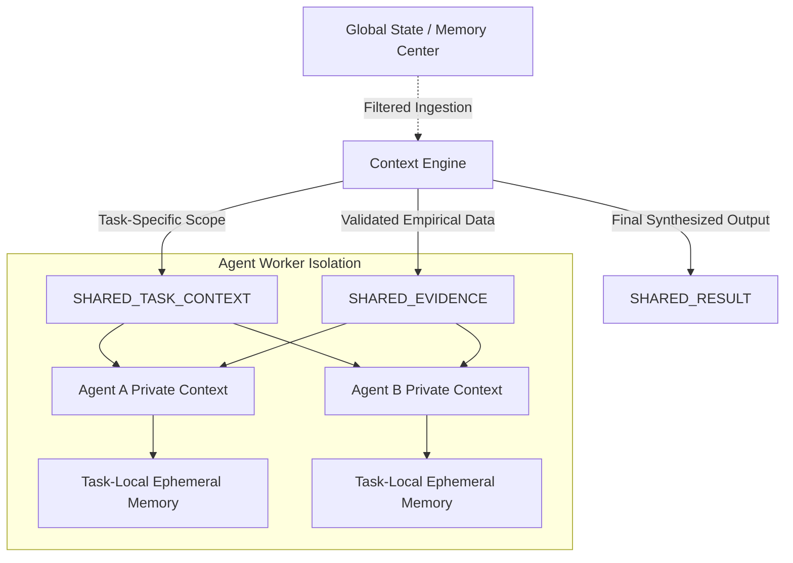

# KAIRO Autonomous Multi-Agent Collaboration, Delegation, Supervision & Swarm Orchestration Engine (Task 96)

## Executive Summary

Task 96 builds KAIRO's production-grade multi-agent collaboration, delegation, supervision, and swarm orchestration engine. It coordinates bounded, specialized worker agents under a strict executive hierarchy while preserving constitutional governance, verifiable security permissions, resource conservation, and empirical outcome verification.

### Core Non-Negotiable Axioms Enforced

$$\mathbf{AGENT \neq AUTHORITY \quad\mid\quad AGENT \neq SECURITY \quad\mid\quad AGENT \neq GOVERNANCE}$$
$$\mathbf{AGENT \neq USER \quad\mid\quad AGENT\ RESULT \neq FACT \quad\mid\quad AGENT\ CONSENSUS \neq TRUTH}$$
$$\mathbf{ROLE \neq PERMISSION \quad\mid\quad DELEGATION \neq PRIVILEGE\ ESCALATION}$$
$$\mathbf{PARENT\ SCOPE \ge CHILD\ SCOPE \quad\mid\quad RESOURCE\ BUDGETS\ MUST\ BE\ CONSERVED}$$
$$\mathbf{CONTEXT\ MUST\ BE\ MINIMAL \quad\mid\quad PRIVATE\ CONTEXT\ MUST\ REMAIN\ PRIVATE}$$
$$\mathbf{UNKNOWN\ MUST\ REMAIN\ UNKNOWN \quad\mid\quad UNVALIDATED\ OUTPUT\ MUST\ NOT\ BECOME\ AUTHORITATIVE}$$
$$\mathbf{EMERGENCY\ STOP\ ALWAYS\ WINS}$$

---

## Separation of Authorities

Agents are workers. They are **never** independent authorities.

| Authority Domain | Responsible Subsystem | Swarm Orchestration Boundary |
| :--- | :--- | :--- |
| **Executive Leadership** | KAIRO Executive & Core Orchestrator | Decomposes high-level objectives into bounded DAG tasks |
| **Deliberation / Decision Selection** | Decision Intelligence (Task 94) | Reconciles major cross-agent disagreements, selects delegation strategies |
| **Action Execution & Transactions** | Action Transactions & Governance (Task 95) | Every mutating tool call or real-world side effect MUST pass through `ActionTransaction` |
| **Low-Level Tool Execution** | `ToolExecutor` & Native Rust Sandboxes | Sole physical executor; agents cannot run tools outside ToolExecutor |
| **Security & Permissions** | SecurityCenter | Authoritative for actor, agent capability scope, permission levels; blocks privilege escalation |
| **Constitutional Policy** | Governance Engine (`PolicyEngine`) | Hard policy constraints, safety fences, environment rules |
| **Approvals** | ApprovalRegistry | Sole authority for human approvals; high-risk agent tasks enter `AWAITING_APPROVAL` |
| **Resource Budgets** | Resource Economy | Swarm-level global budget $\ge$ child budgets; prevents runaway resource amplification |
| **Capability Usability** | Capability Lifecycle (Task 91) | Enforces active capability versions; detects retired or degraded capabilities |
| **Memory Promotion** | Memory Consolidation (Task 92) | Agent working memory is task-local and temporary; long-term promotion requires Task 92 |
| **Context Isolation** | Context Engineering (Task 93) | Delivers minimum necessary context (`PRIVATE`, `SHARED_TASK`, `SHARED_EVIDENCE`, `SHARED_RESULT`) |
| **Emergency Halt** | `EmergencyStopService` | Immediate fail-closed kill switch across all agents and running swarms |

---

## The Operational Swarm Pipeline



---

## 14-State Agent Lifecycle Machine



---

## Delegation Safety & Hard Limits

To prevent infinite recursion, capability escalation, and resource exhaustion:
1. **Maximum Delegation Depth**: $\le 4$ levels (configurable per swarm).
2. **Maximum Children Per Agent**: $\le 5$ sub-agents.
3. **Maximum Total Swarm Agents**: $\le 15$ concurrent workers.
4. **Maximum Tasks**: $\le 30$ tasks per swarm session.
5. **Parent Scope Dominance**: A child agent can only be granted a strict subset of the parent agent's capability and resource scope.
6. **Execution Barrier**: Agents cannot directly execute tools; all side effects are routed through `ActionTransaction` with `SecurityCenter` re-validation.

---

## Context Isolation & Scoping (Task 93 Integration)

Agents operate under a strict "least-privilege visibility" policy. Unrestricted global chat logs, private user memories, and sibling working states are never exposed by default.



- **PRIVATE_AGENT_CONTEXT**: Internal thought process, temporary intermediate scratchpad, and local tool execution traces.
- **SHARED_TASK_CONTEXT**: Objective, bounded problem statement, constraints, and deadline.
- **SHARED_EVIDENCE**: Validated findings, blackboard artifacts, and citations from peer workers.
- **SHARED_RESULT**: Output produced by an agent upon task completion, prior to collective synthesis.

---

## Result Contract & Empirical Validation (Phase 19 & 20)

Every agent worker produces a strongly typed `AgentResult`:

```python
class AgentResult(BaseModel):
    task_id: str
    agent_id: str
    status: str
    result_summary: str
    structured_output: dict[str, Any]
    evidence: list[dict[str, Any]]
    confidence: float
    uncertainty: float
    assumptions: list[str]
    warnings: list[str]
    provenance: dict[str, Any]
    execution_metadata: dict[str, Any]
    validation_status: ValidationStatus
```

### Result Status Taxonomy
1. **VALIDATED**: Output matches schema, evidence citations verified, no policy contradictions found.
2. **UNVALIDATED**: Newly submitted result awaiting independent peer review or verification probe.
3. **INVALID**: Schema malformed, evidence citation missing, or deterministic verification failed.
4. **CONTRADICTED**: Result directly conflicts with physical evidence or verified assertions from another agent.
5. **UNKNOWN**: Outcome unverified due to timeout or crash.

---

## Non-Lossy Disagreement, Consensus & Dialectic Synthesis

KAIRO explicitly rejects naive majority voting. If 4 agents claim a configuration is safe and 1 agent proves it violates a constitutional safety fence, the minority claim is preserved.

### Consensus Classifications
- `CONSISTENT`: All agents agree with overlapping supporting evidence.
- `PARTIALLY_CONSISTENT`: Core findings align, but minor non-critical variances exist in secondary recommendations.
- `CONFLICTED`: Agents take contradictory stances on feasibility, safety, or core facts.
- `INSUFFICIENT_EVIDENCE`: Agents cannot substantiate claims with verifiable evidence.
- `UNKNOWN`: Consensus undetermined due to missing or interrupted evaluations.

When a conflict is detected:
1. `DisagreementDetector` classifies the contradiction across the 10-class taxonomy (`FACTUAL`, `EVIDENCE`, `CAUSAL`, `ASSUMPTION`, `OBJECTIVE`, `SCOPE`, `TEMPORAL`, `MODEL`, `INTERPRETATION`, `PREFERENCE`).
2. An evidence-weighted synthesis is created containing both the primary conclusion and a distinct `MinorityReport`.
3. If unresolvable, the issue is escalated to Task 94 Decision Intelligence for human operator deliberation.

---

## Supervision, Stall Detection & Self-Healing (Phase 24 & 25)

The `SwarmSupervisionEngine` monitors all workers on active swarms:
- **HEALTHY**: Progressing normally within deadline and resource allocations.
- **SLOW**: Progress rate is below velocity expectations, but actively working.
- **STALLED**: No heartbeat, no messages, and no state updates for greater than `stall_threshold_seconds` (default: 60s).
- **FAILING**: Repeated exceptions or consecutive validation rejections.
- **RUNAWAY**: Exceeding CPU/memory budget or attempting unauthorized recursive delegation.

### Corrective Actions
- **Bounded Retry**: Retries task with exponential backoff up to `max_retries` (default: 3).
- **Replacement Agent**: Spawns a clean agent worker with a re-scoped prompt if the previous worker remains failed.
- **Graceful Degradation**: Continues execution with partial validated results if task criticality allows.

---

## Crash Recovery & State Reconstruction (Phase 44)

In the event of a process crash or service restart:
1. Swarm state is reconstructed from persisted `agent_identities`, `agent_orchestration_tasks`, and `agent_messages`.
2. Any worker in `RUNNING` or `INITIALIZING` state without an active process is transitioned to `FAILED` or `TERMINATED` with `lifecycle_reason="Reconstructed after unexpected daemon termination"`.
3. Orphaned or ambiguous tasks remain in `UNKNOWN` state to prevent phantom success assertions.

---

## REST API & CLI Quick Reference

### REST Endpoints
- `GET /api/swarms` — List all active and archived swarm sessions.
- `POST /api/swarms` — Create and initialize a new swarm session.
- `GET /api/swarms/{id}` — Retrieve swarm topology, status, and metrics.
- `GET /api/swarms/{id}/graph` — Get task dependency DAG and execution states.
- `GET /api/swarms/{id}/agents` — List all agents scoped to a specific swarm.
- `GET /api/swarms/{id}/results` — Fetch submitted results and validated collective synthesis.
- `GET /api/swarms/{id}/conflicts` — Inspect active disagreements and minority reports.
- `POST /api/swarms/{id}/pause` — Pause all active agents on a swarm.
- `POST /api/swarms/{id}/resume` — Resume paused agents on a swarm.
- `POST /api/swarms/{id}/cancel` — Cancel swarm and terminate all workers.
- `POST /api/swarms/{id}/reconcile` — Crash recovery and orphan agent cleanup.
- `GET /api/agents` — List all scoped agent identities.
- `GET /api/agents/{id}` — Get agent identity, capability scope, and lifecycle history.
- `GET /api/agents/{id}/tasks` — Get tasks assigned to an agent.
- `GET /api/agents/{id}/messages` — Get message history for an agent.
- `GET /api/agents/{id}/health` — Evaluate stall state and supervisor health metrics.
- `POST /api/agents/{id}/cancel` — Abort a specific agent worker.
- `POST /api/agents/{id}/retry` — Trigger a bounded retry on a failed agent.
- `POST /api/agents/{id}/reassign` — Reassign an agent worker to a new role.

### CLI Commands
```bash
# Swarm management
python -m app.swarm.cli swarm list
python -m app.swarm.cli swarm inspect <swarm_id>
python -m app.swarm.cli swarm graph <swarm_id>
python -m app.swarm.cli swarm cancel <swarm_id>
python -m app.swarm.cli swarm reconcile <swarm_id>

# Agent management
python -m app.swarm.cli agent list
python -m app.swarm.cli agent inspect <agent_id>
python -m app.swarm.cli agent tasks <agent_id>
python -m app.swarm.cli agent cancel <agent_id>
python -m app.swarm.cli agent retry <agent_id>
python -m app.swarm.cli agent reassign <agent_id> --role <ROLE>
```
