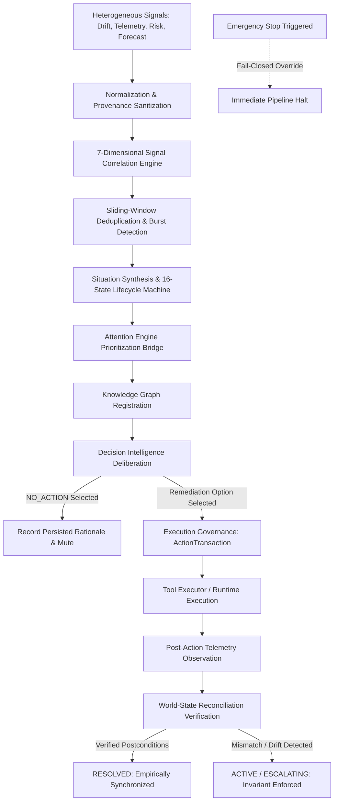
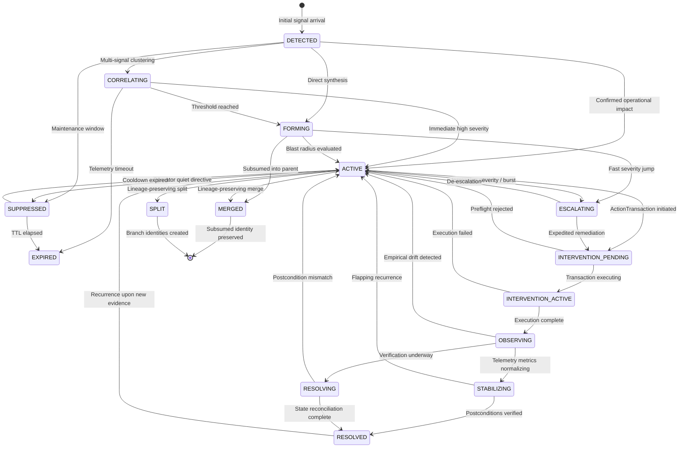

# KAIRO Autonomous Situation Awareness, Signal Fusion & Proactive Response Orchestrator (Task 99)

## Executive Summary

Task 99 establishes the **Situational Awareness & Proactive Response Orchestration Subsystem** within KAIRO. This subsystem bridges heterogeneous observation streams (telemetry, world-state drift, risk findings, forecasts, agent reports) with the deliberate operational responses of KAIRO's authoritative engines (Decision Intelligence, Execution Governance, Attention Engine, Knowledge Graph).

It continuously answers:
- **What signals are arriving**: Multi-source normalized signals classified by source trust level, sensitivity, and provenance.
- **How signals correlate**: 7-dimensional correlation across temporal, topological/entity, scope, causal, graph, operational, and semantic dimensions.
- **What situation exists**: Synthesized, lineage-preserving operational situations reflecting evolving reality rather than raw noisy alarms.
- **What attention priority is warranted**: Ranked evaluation submitted to the Attention Engine without bypassing attention gating.
- **What action or non-action is optimal**: Deliberation through Decision Intelligence, with first-class `NO_ACTION` support.
- **Whether reality actually changed**: Strict post-action state verification via the World-State Reconciliation Engine (`EXECUTION != VERIFIED STATE`).

### Non-Negotiable Invariants Enforced

$$\mathbf{SIGNAL \neq SITUATION \quad\mid\quad SITUATION \neq TRUTH}$$
$$\mathbf{CORRELATION \neq CAUSATION \quad\mid\quad FORECAST \neq OBSERVATION}$$
$$\mathbf{SIMULATION \neq REALITY \quad\mid\quad AGENT\ OUTPUT \neq AUTHORITY}$$
$$\mathbf{ATTENTION \neq DECISION \quad\mid\quad DECISION \neq AUTHORIZATION}$$
$$\mathbf{AUTHORIZATION \neq EXECUTION \quad\mid\quad EXECUTION \neq SUCCESS}$$
$$\mathbf{SUCCESS \neq VERIFIED\ STATE \quad\mid\quad VERIFIED\ STATE \neq PERMANENT\ STABILITY}$$
$$\mathbf{EMERGENCY\ STOP\ ALWAYS\ WINS}$$

---

## 1. Separation of Authorities

The Situational Awareness Subsystem is a **synthesizing, coordinating, and orchestrating layer**. It strictly coordinates with and defers to authoritative subsystems for decision-making, authorization, execution, and reality verification:

| Subsystem | Authority Domain | Task 99 Role & Boundary |
| :--- | :--- | :--- |
| **SecurityCenter** | Clearances, permissions, access tokens, credentials | **Sole authorization authority**. Situations never grant execution permissions. SecurityCenter evaluates all proactive action attempts. |
| **Governance Engine (`PolicyEngine`)** | Safety invariants, constitutional constraints | **Sole policy authority**. Proactive responses must satisfy policy preflight checks before any transaction is initiated. |
| **ApprovalRegistry** | Human-in-the-loop approvals | **Sole approval authority**. Autonomous execution without human approval is strictly limited to low-risk benign automated remediations. |
| **Resource Economy** | Quotas, compute budgets, execution credits | **Sole resource authority**. Situational Awareness does not allocate budgets; it requests resource evaluation from the Economy. |
| **Decision Intelligence (Task 94)** | Trade-off deliberation, Pareto ranking, option choice | **Sole decision authority**. Situational Awareness prepares bounded context; Decision Intelligence deliberates and selects options (including `NO_ACTION`). |
| **Execution Governance (Task 95)** | Transaction execution, preflight verification, rollbacks | **Sole execution authority**. Situational Awareness initiates two-phase commit `ActionTransaction`s but never executes tools directly. |
| **World-State Reconciliation (Task 98)** | Reality verification, drift detection, state truth | **Sole state verification authority**. `EXECUTION != VERIFIED STATE`. A situation is only resolved when post-action reality reconciliation confirms postconditions. |
| **Attention Engine** | Saliency scoring, cognitive load regulation | **Sole attention authority**. Situational Awareness submits candidates; Attention Engine scores priority. |
| **Knowledge Graph (Task 97)** | Entity topology, multi-hop relationship reasoning | **Sole graph authority**. Situations register nodes and edges in the Knowledge Graph for historical and structural reasoning. |
| **EmergencyStop** | Global emergency halt | **Absolute fail-closed gate**. When active, all proactive proposals, interventions, and external calls are halted immediately. |

---

## 2. Operational Pipeline Architecture

---

## 3. The 16 Operational Lifecycle States

The operational lifecycle state machine enforces rigid transitions to prevent premature resolutions or unverified assumptions:

---

## 4. 7-Dimensional Correlation Matrix

Signal affinity is computed across seven orthogonal dimensions:

1. **Temporal Dimension**: Sliding windows, burst frequency evaluation, escalating repetition rates.
2. **Topological / Entity Dimension**: Direct subject matching, resource hierarchy matching, subnet/cluster boundaries.
3. **Operational Scope Dimension**: Matching tenants, projects, environments, workflows, or goals.
4. **Causal Dimension**: Explicit causal model links (Task 73) and shared root-cause identifiers.
5. **Knowledge Graph Dimension**: Multi-hop structural dependency paths (Task 97).
6. **Operational Context Dimension**: Trace ID, correlation ID, parent transaction ID matching.
7. **Semantic Dimension**: Compatible signal taxonomy classifications and metric anomaly profiles.

---

## 5. Critical Invariants

### Invariant 1: `EXECUTION != VERIFIED STATE`
An executed action reporting success (e.g. `TransactionStatus.SUCCEEDED`) is **never** accepted as proof of situation resolution. The orchestrator requires independent, empirical verification from the `WorldStateReconciliationEngine`:
- If postconditions match telemetry: Situation transitions to `STABILIZING` $\rightarrow$ `RESOLVED`.
- If postconditions do not match (e.g. quota failure, silent daemon crash): Situation remains `ACTIVE` or `ESCALATING`, the intervention is marked `NOT_VERIFIED`, and re-deliberation is scheduled.

### Invariant 2: `EMERGENCY STOP ALWAYS WINS`
When `EmergencyStopService.is_stopped()` is true:
- Observation and timeline logging continue for forensic purposes.
- All proactive intervention proposals, `ActionTransaction` creation, tool execution, and state mutations are **blocked fail-closed**.
- An explicit audit timeline entry `PROACTIVE_PIPELINE_HALTED` is persisted.

### Invariant 3: First-Class `NO_ACTION` Path
`NO_ACTION` is not an unhandled edge case or silent drop. It is a first-class operational decision:
- If a situation is low-severity, actively suppressed, or Decision Intelligence concludes that intervention utility is negative:
- `report["status"] = "NO_ACTION"`
- Rationale is recorded in the immutable situation timeline (`NO_ACTION_DECIDED`).
- Zero mutating transactions are dispatched.

### Invariant 4: Lineage-Preserving Merges and Splits
- **Merge**: Secondary situations are marked `MERGED` with `merged_into_id` pointing to the primary situation. Primary situation records `merged_from_ids`. Neither signal provenance nor secondary timeline history is deleted.
- **Split**: When evidence diverges, the parent is marked `SPLIT`. Child situations record `split_from_id`, inheriting relevant partitions of signals and entities.

---

## 6. Verification and Test Coverage

| Test Suite / Script | Coverage | Status |
| :--- | :--- | :--- |
| `tests/test_situations_*.py` | 31 legacy situation tests (Task 60 backward compatibility) | ✅ **31 / 31 Passed** |
| `tests/test_situational_awareness.py` | 14 Task 99 operational and invariant tests | ✅ **14 / 14 Passed** |
| `scripts/verify_situational_awareness_e2e.py` | 8 End-to-End operational verification scenarios | ✅ **8 / 8 Passed (Exit code 0)** |
| `frontend/tests/situations.test.js` | 7 Frontend API and UI view component tests | ✅ **7 / 7 Passed** |
| `alembic upgrade head --sql` | Migration DAG revision `0067` generation check | ✅ **Verified (Exit code 0)** |
