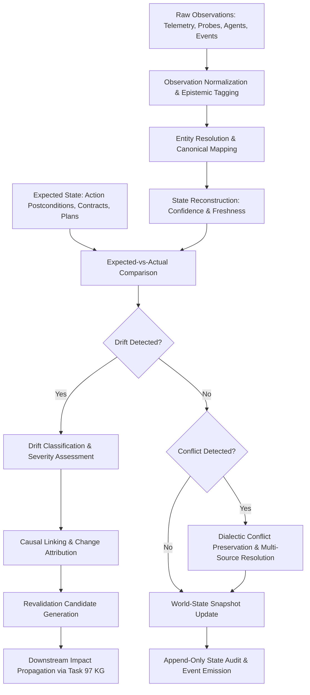

# KAIRO Autonomous World-State Reconstruction, State Estimation, Reality Synchronization & Drift Reconciliation Engine (Task 98)

## Executive Summary

Task 98 establishes the **State Reconciliation and Reality Synchronization Layer** within KAIRO. This subsystem coordinates between observation streams, operational expectations, current beliefs, and physical/system reality. It continuously answers:

- **What KAIRO observes**: Multi-source empirical telemetry, tool probes, agent reports, and external events.
- **What KAIRO expects**: Target postconditions from Action Transactions (Task 95), capability contracts (Task 91), workflow states, simulation projections (Task 89), and decision assumptions (Task 94).
- **What KAIRO currently believes**: The reconstructed, verified, time-indexed world state.
- **What is verified vs uncertain**: Epistemic segregation preventing uncorroborated assertions from masquerading as verified truth.
- **What has drifted**: Divergences between expected state and empirical actual state.
- **What needs revalidation**: Bounded revalidation candidate generation for downstream dependencies (Task 97) and risk propagation (Task 55).

### Core Non-Negotiable Axioms Enforced

$$\mathbf{OBSERVATION \neq TRUTH \quad\mid\quad EXPECTED\ STATE \neq ACTUAL\ STATE}$$
$$\mathbf{MISSING\ DATA \neq NO\ CHANGE \quad\mid\quad STALE \neq CURRENT}$$
$$\mathbf{DRIFT \neq CAUSE \quad\mid\quad CORRELATION \neq CAUSATION}$$
$$\mathbf{SIMULATION \neq REALITY \quad\mid\quad EXECUTION \neq VERIFIED\ STATE}$$
$$\mathbf{STATE \neq AUTHORIZATION \quad\mid\quad STATE \neq GOVERNANCE}$$
$$\mathbf{UNKNOWN\ MUST\ REMAIN\ UNKNOWN \quad\mid\quad CONFLICT\ MUST\ REMAIN\ VISIBLE}$$
$$\mathbf{HISTORICAL\ STATE\ MUST\ REMAIN\ RECONSTRUCTABLE}$$
$$\mathbf{UNATTRIBUTED\ CHANGE\ MUST\ NOT\ RECEIVE\ A\ FABRICATED\ ACTOR}$$
$$\mathbf{SECURITYCENTER\ REMAINS\ THE\ ONLY\ AUTHORIZATION\ AUTHORITY}$$
$$\mathbf{GOVERNANCE\ REMAINS\ THE\ POLICY\ AUTHORITY}$$
$$\mathbf{APPROVALREGISTRY\ REMAINS\ THE\ APPROVAL\ AUTHORITY}$$
$$\mathbf{RESOURCE\ ECONOMY\ REMAINS\ THE\ RESOURCE\ AUTHORITY}$$
$$\mathbf{EMERGENCY\ STOP\ ALWAYS\ WINS}$$

---

## 1. Separation of Authorities

The World-State Reconciliation Engine is an **epistemic observer, estimator, and reconciliation layer**. It possesses **zero autonomous authorization or policy power**.

| Subsystem | Authority Domain | Task 98 Reconciliation Engine Role |
| :--- | :--- | :--- |
| **SecurityCenter** | Clearances, permissions, access tokens, credentials | **Sole authorization authority**. State queries and observations must enforce security boundaries. State never grants privileges. |
| **Governance Engine (`PolicyEngine`)** | Constitutional bounds, safety invariant policies | **Sole policy authority**. Discovered drift or state transitions can never override safety rules. |
| **ApprovalRegistry** | Human-in-the-loop gating | Sole approval authority. State reconciliation flags revalidation candidates but cannot approve remediations. |
| **Resource Economy** | Quota, compute, memory, bandwidth limits | Sole resource authority. State engine monitors resource consumption drift against allocated budgets. |
| **Action Transactions (Task 95)** | Transactional side-effect execution & rollbacks | State engine inspects post-action state to verify whether postconditions actually occurred. Completed execution $\neq$ verified success. |
| **Decision Intelligence (Task 94)** | Option ranking, tradeoffs, goal satisfaction | State engine reports assumption failures and unexpected side effects back to the decision feedback loop. |
| **Causal Engine (Task 73)** | Empirical causal graphs, counterfactuals | State engine queries causal links to explain observed drift without confusing correlation with causation. |
| **Knowledge Graph (Task 97)** | Associative reasoning, dependency intelligence | State engine maps canonical entity dependencies to compute blast radius and downstream revalidation targets. |
| **Memory Consolidation (Task 92)** | Long-term episodic and semantic memory | Verified, stable world-state changes are submitted as candidate facts to the consolidation pipeline. |
| **EmergencyStop** | Global panic halt | **Absolute fail-closed switch**. Immediately blocks all autonomous state mutations and active reconciliations. |

---

## 2. The Conceptual Pipeline



---

## 3. Epistemic Status & State Lifecycle

Every state record and observation is explicitly labeled with its epistemic degree of certainty:

- **`OBSERVED`**: Direct measurement from an authoritative probe or telemetry stream.
- **`DERIVED`**: Deterministically computed from verified observations through strict invariants.
- **`INFERRED`**: Heuristic or statistical attribution (clearly distinguished from observed fact).
- **`PREDICTED`**: Forecasted or simulated counterfactual state; **never treated as current reality**.
- **`UNKNOWN`**: Unobserved or missing data. **Missing data $\neq$ healthy/unchanged state**.

### State Transition Matrix

```
[OBSERVED] --------------> [RECONSTRUCTING] --------------> [CURRENT]
                                                                |
           +--------------------+-------------------------------+--------------------+
           |                    |                               |                    |
           v                    v                               v                    v
        [STALE]             [DRIFTED]                     [CONFLICTED]          [UNCERTAIN]
           |                    |                               |                    |
           +--------------------+-------------------------------+--------------------+
                                |
                                v
                          [INVALIDATED] --------------> [SUPERSEDED] --------------> [ARCHIVED]
```

---

## 4. Drift Types & Severity Taxonomy

Drift is categorized into structured classes with explicit severity derived from existing risk/criticality models:

1. **`CONFIGURATION_DRIFT`**: Discrepancy between declared configuration and live runtime settings.
2. **`STATE_DRIFT`**: Deviation between expected operational status and observed component status.
3. **`DEPENDENCY_DRIFT`**: Unexpected addition, removal, or version change of an upstream/downstream dependency.
4. **`CAPABILITY_DRIFT`**: Degradation or contract mismatch in registered capability versions.
5. **`RESOURCE_DRIFT`**: Memory, CPU, or cost consumption exceeding allocated envelopes.
6. **`POLICY_DRIFT`**: Local configuration diverging from global governance policies.
7. **`BEHAVIORAL_DRIFT`**: Execution latency, throughput, or error rates diverging from baseline profiles.
8. **`PERFORMANCE_DRIFT`**: SLA degradation against empirical commitments.
9. **`SCHEMA_DRIFT`**: Database, payload, or API schema modifications.
10. **`ENVIRONMENT_DRIFT`**: Unannounced infrastructure or network topology mutations.
11. **`MODEL_DRIFT`**: AI model output distribution or accuracy shifts.

---

## 5. Change Attribution & Invariant Verification

- **Attributed Change**: When state changes match a registered `ActionTransaction`, `Decision`, `Capability rollout`, or `User command`, the lineage chain is explicitly linked.
- **Unattributed Change**: If state shifts without an explanatory event, it is strictly flagged as `UNATTRIBUTED_CHANGE`. **KAIRO never hallucinates or fabricates an actor**.
- **Invariants**:
  1. Active capabilities must reference valid, deployed capability versions.
  2. Retired capabilities cannot execute or report healthy status.
  3. Completed workflows must satisfy terminal states.
  4. Post-action verification must confirm postconditions empirically before declaring success.
  5. Missing telemetry transitions entity freshness to `STALE` and status to `UNKNOWN`.
