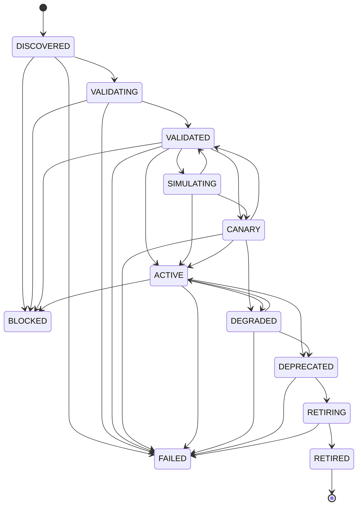

# Kairo Autonomous Capability Lifecycle, Versioning, Compatibility & Safe Evolution Engine (Task 91)

## 1. Executive Summary & Core Doctrine

Task 91 establishes Kairo's **Autonomous Capability Lifecycle, Versioning, Compatibility & Safe Evolution Engine**.
It manages application-level capabilities (`TOOL`, `NATIVE_RUNTIME`, `MODEL_PROVIDER`, `WORKFLOW`, `INTEGRATION`, `COMPOSITE`) through their complete evolutionary lifecycle:

$$\text{DISCOVER} \longrightarrow \text{VALIDATE} \longrightarrow \text{CONFORMANCE} \longrightarrow \text{COMPATIBILITY} \longrightarrow \text{SIMULATE} \longrightarrow \text{CANARY} \longrightarrow \text{PROMOTE} \longrightarrow \text{LEARN}$$

And upon operational anomalies or failures:

$$\text{FAIL} \longrightarrow \text{DIAGNOSE} \longrightarrow \text{ROLLBACK / CONTAIN} \longrightarrow \text{VERIFY} \longrightarrow \text{RECORD LESSON}$$

### The Supreme Platform Invariant
$$\mathbf{AUTONOMOUS\ EVOLUTION \neq AUTONOMOUS\ AUTHORIZATION}$$

1. **SecurityCenter** remains the **SOLE** authorization authority. Capability metadata never grants execution privileges.
2. **Governance & Constitution** remains the **SOLE** policy authority. The lifecycle engine cannot invent constitutional policy.
3. **ApprovalRegistry** remains the **SOLE** human-in-the-loop approval authority for privileged capabilities.
4. **Resource Economy** remains the **SOLE** compute budget and quota allocator. Capabilities have bounded envelopes.
5. **EmergencyStop** remains the **ABSOLUTE** safety override. When active, all mutating lifecycle operations abort fail-closed.
6. **ToolRegistry & ToolExecutor** remain the source of truth for tool execution. The lifecycle engine manages metadata, versioning, rollout, and compatibility.

---

## 2. 12-State Lifecycle State Machine

Capabilities follow an explicit, deterministic 12-state transition matrix:

### Transition Guarantees
- **No external bypasses:** State transitions must pass through `CapabilityStateMachine.transition()`.
- **Tamper-evident audit:** Every transition logs an immutable `LifecycleTransitionEvent` with `from_state`, `to_state`, `reason`, `actor`, `correlation_id`, and `timestamp`.
- **Terminal safety:** `RETIRED` is strictly terminal. No resurrected capabilities.

---

## 3. SemVer & Immutability Rules

1. **Active Version Immutability:** Once a capability version becomes `ACTIVE`, it is locked against modification.
2. **Material Changes Require SemVer Bump:** If the contract, implementation bytecode, resource profile, or dependencies change, a new SemVer version record (`CapabilityVersionRecord`) must be registered.
3. **Lineage Tracking:** Every new version explicitly maintains pointers to `supersedes` and `superseded_by`.
4. **Deterministic Fingerprints:**
   - Contract schema: `cfp_<sha256[:24]>`
   - Implementation descriptor: `ifp_<sha256[:24]>`
   - Dependency set: `dfp_<sha256[:24]>`
   - Composite identity: `cmp_<sha256[:24]>`

---

## 4. 11 Mandatory Promotion Safety Gates

Before any candidate version transitions to `ACTIVE`, all 11 gates must evaluate to `True`:

| Gate # | Name | Authority / Source | Fail-Closed Criterion |
|---|---|---|---|
| 1 | **EmergencyStop Inactive** | `EmergencyStopService` | Aborts immediately if global or user kill-switch is active |
| 2 | **Validation Passed** | `CapabilityValidator` | Valid SemVer, parameters schema is object, resources bounded |
| 3 | **Conformance Suite Passed** | `ConformanceTestRunner` | Zero failing deterministic vectors, idempotency verified |
| 4 | **Dependency Compatibility** | `CapabilityDependencyGraph` | Constraints satisfied, zero degraded upstream dependencies |
| 5 | **SecurityCenter Authorization** | `SecurityCenter` | Required permissions audited and authorized |
| 6 | **Constitutional Governance** | `Governance` | No constitutional invariant breaches |
| 7 | **Resource Economy Quota** | `ResourceEconomy` | Headroom available for CPU, memory, and concurrency bounds |
| 8 | **Digital Twin Simulation** | `SimulationGate` (Task 89) | Blast radius $\le 40\%$, simulation status fresh ($< 30$ min) |
| 9 | **Reliability Baseline** | `ReliabilityIntelligence` (Task 90) | Success rate $\ge 80\%$, stability window passed, health not degraded |
| 10 | **Canary Rollout Passed** | `CanaryRolloutManager` | Canary traffic completed without error rate or latency breaches |
| 11 | **Approval Obtained** | `ApprovalRegistry` | Mandatory human sign-off obtained if privileged or destructive |

---

## 5. Automated Rollback & Health Cascades

1. **Canary Automated Containment:** If canary error rate exceeds threshold (e.g. $> 5\%$) or latency spikes ($> 500$ ms), the canary is aborted immediately, transitioning the version to `DEGRADED`.
2. **Safe Rollback Verification:** Rollbacks revert to the previously active version, re-verify synthetic health probes, and record a `RollbackRecord`.
3. **Downstream Health Degradation:** If an upstream capability (e.g., TLS runtime, Database) degrades, `CapabilityDependencyGraph` propagates degradation to all downstream dependents, transitioning active dependents to `DEGRADED` and blocking new promotions.

---

## 6. Deprecation & Retirement Safety

1. **Sunset Window:** Deprecation establishes a sunset deadline (default 30 days) and migration guidance.
2. **Consumer Blocking:** A capability cannot be retired if active dependents or workflows still depend on it, unless an explicit administrative override (`force_retirement=True`) is authorized.
